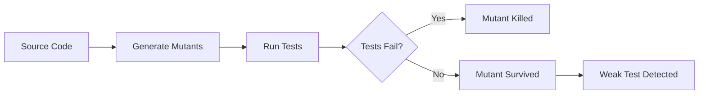

## Summary

Stryker Mutator is a mutation testing framework that evaluates test suite quality by introducing deliberate bugs into source code. If tests fail, the mutant is "killed"—the tests caught the bug. If tests pass, the mutant "survived"—exposing a gap in test coverage.

## How It Works

::

Stryker modifies code in small ways—changing `>=` to `>`, swapping `true` for `false`, or replacing `&&` with `||`. Each mutation creates a version of the code that should fail tests. Surviving mutants indicate tests that verify execution but don't actually validate behavior.

## Key Insight

Code coverage answers: "Did my tests run this code?"

Mutation testing answers: "Would my tests catch a bug here?"

A test suite with 100% coverage can still have 0% mutation score if it never makes meaningful assertions.

## Platform Support

| Framework   | Language               |
| ----------- | ---------------------- |
| StrykerJS   | JavaScript, TypeScript |
| Stryker.NET | C#                     |
| Stryker4s   | Scala                  |

## Connections

- [[mutation-testing-skill]] - Explains the mutation testing methodology in depth, including mutation operators and systematic analysis process—Stryker automates what that skill describes manually
