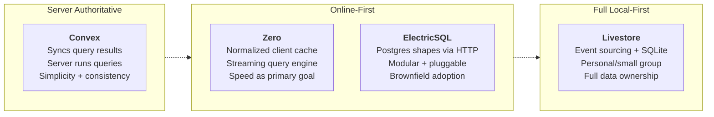

## Overview

Four people who've bet their careers on sync sit on stage together: Aaron Boodman (Zero), James Cowling (Convex), Johannes Schickling (Livestore), and Kyle Mathews (ElectricSQL). Aaron moderates, but the panel quickly becomes a genuine conversation where the interesting bits emerge from disagreement—not consensus.

The consensus part is easy: React is boring now, the data layer is where innovation matters, and AI makes sync infrastructure more important, not less. The tensions are more revealing.

## Key Arguments

### The Rendering Era Is Over — Data Is the New Frontier

Johannes opens with the hot take that drove the last five years of his work: he didn't want to waste time on another variant of React server rendering. The entire industry has turned that stone over three times. Kyle frames it memorably: we're in the "jQuery era of data"—manual REST setups, RPC calls, cache invalidation—when what we need is a declarative system where you state what data you want and it shows up.

James adds the environmental explanation: React becoming mundane freed up the "innovation token" for data. When React was the risky bet, nobody had budget for exotic data sync too. This is a useful mental model—teams can only adopt one risky technology at a time.

### What "Sync" Means Depends on What You're Building

Each builder has a subtly different definition, and the differences reveal their values:

- **Aaron (Zero):** Sync means data on the client for speed. Full stop. The dropdown can be instant, but if clicking it takes a second to cross the earth, you've lost.
- **James (Convex):** Sync means synchronizing _query results_, not raw tables. He cares less about performance and more about architectural simplicity—if the data is available, the client can render it.
- **Johannes (Livestore):** Sync trades off differently depending on audience. Building for a person or a family? Sync the whole thing. Building Slack? Entirely different calculus.
- **Kyle (ElectricSQL):** Sync is the abstraction that makes server data appear on the client as if by magic—the "React of data transfer."

### The Server Authority vs. Local-First Spectrum

James makes the deliberately provocative claim for this venue: "I am a pro-centralization person." Server authority yields simpler, more consistent systems. Throw your laptop in the lake—that's fine, because state lives on the server. Convex syncs query results, not tables. The server runs the queries.

Johannes sits at the opposite end. [[livestore]] uses event sourcing with client-side SQLite. For personal software—a family photo gallery, a grocery list—you can sync the whole dataset and own it locally. The seven local-first ideals from Ink & Switch aren't aspirational for him; they're design requirements.

Aaron and Kyle land in the middle. Zero maintains a normalized client cache with a streaming query engine—online-first rather than offline-first. ElectricSQL takes the most modular approach: stream Postgres "shapes" (table subsets) via HTTP, plug in whatever client store you want.

::

### AI Makes Sync More Important, Not Less

Aaron had been struggling with the "why now?" pitch until the morning of the panel. His realization: as AI lifts application development to higher abstraction, the layer below needs to be solid and generalized. Sync engines are the natural substrate. James agrees—AI agents need reliable, real-time data access. The platforms that serve AI best will be sync-native.

This flips the narrative. AI isn't a distraction from sync infrastructure—it's the reason sync infrastructure becomes essential.

## How Each Engine Works

Each panelist gave a three-minute architecture tour. No slides, just words—which forces the essential abstractions to the surface.

### Zero (Aaron Boodman)

Zero evolved from Replicache, Rocicorp's earlier sync engine. Replicache was deliberately simple: client-side only, data in IndexedDB, two server endpoints (push and pull). People loved it for small apps. It fell apart once apps reached real complexity—storing all data on the device wasn't practical, and computing deltas for per-user access patterns (imagine Slack, where every user sees different channels) was expensive.

Zero's answer: a **normalized client-side cache** with a **custom streaming query engine**. You write queries directly on the client using a full query language. Those queries store results in a normalized (deduplicated, relational) cache. The next query runs against that cache instantly. Writes also hit the cache first.

The hard part—and what distinguishes Zero technically—is the streaming query engine they call "zql." It runs on both client and server, maintaining live query results by processing only deltas rather than re-evaluating full queries. Aaron admits this is "not based on things in the literature"—they went off the beaten path to make incremental sync work for large relational datasets.

**What Zero trades away:** No offline writes (deliberately deferred). No aggregates yet. Must use Zero's own query language rather than arbitrary logic. Building a streaming query engine from scratch is brutally hard, so feature parity with SQLite takes time.

### Convex (James Cowling)

James is the distributed systems guy who chose simplicity and consistency over local autonomy. Convex replaces the legacy model—centralized database, trusted server—and makes it sync. The server is the single authoritative source of truth.

The key distinction: Convex syncs **query results** to the client, not raw tables. You don't mirror your database locally. You don't run queries on the client. Instead, the server runs transactional TypeScript stored procedures, computes the result, and pushes that transformed data to every subscribed client in real time.

This means consistency is guaranteed—no race conditions, no last-writer-wins, no eventual consistency reconciliation. The cost: you depend on the server being available. No local store for instant offline queries. Optimistic updates exist, but the mental model is fundamentally server-centric.

James frames this as a feature: "Throw your laptop in the lake." Important state lives on the server. For collaborative business applications with complex access control, this eliminates entire categories of bugs.

### ElectricSQL (Kyle Mathews)

Electric deliberately chose modularity over vertical integration. Unlike the others, Electric has no opinions about how you write data back to the server—it's read-sync only out of Postgres.

The core primitive is a **shape**: a table plus a WHERE clause. Electric streams that subset of Postgres data to clients via an HTTP API with long-polling. That's it. Went 1.0 with this approach, launched Electric Cloud.

The "what do you do with it?" question led to the client-side piece: **TanStack DB** (built with the TanStack ecosystem). TanStack DB is a pluggable client store—it has an Electric plugin for real-time Postgres streams, but also works with PowerSync, TanStack Query for regular APIs, and other sources. Uses differential data flow for live-updating queries. Includes optimistic mutations, client-server transactions, and rollbacks.

**What Electric trades away:** Can't make consistency guarantees like Convex (no control over writes). More DIY assembly required—you pick your own write path. But the modularity pays off for brownfield adoption: if you already have Postgres and a bunch of APIs, Electric slides in without rewriting everything.

### Livestore (Johannes Schickling)

Johannes asks the audience to forget about server-side databases entirely. Livestore is built on **event sourcing**, inspired by Martin Kleppmann's "Turning the Database Inside Out" talk.

The model: instead of mutating rows directly, you record immutable events (like bank transactions rather than balance updates). Your application state materializes from replaying those events. Need to change your data model? Just write new materializers and replay from the event log. No schema migrations—ever.

On the client, this runs as a **reactive SQLite** database at 120fps. Events commit locally, materializers translate them into SQL, and the UI updates instantly. A sync engine distributes events across clients in the background. The aspiration: "git for application data"—branch, replay, recompute.

**What Livestore trades away:** Not designed for large multi-user applications. You wouldn't build Slack or Facebook with it. Access control for thousands of users with different permissions isn't the target. It's purpose-built for personal software and small groups—families, individuals—where you can sync the entire dataset and own the data locally.

## The Trade-Off Matrix

The panel's most valuable contribution is making trade-offs explicit. Every engine sacrifices something:

|                       | **Convex**               | **Zero**                 | **ElectricSQL**        | **Livestore**        |
| --------------------- | ------------------------ | ------------------------ | ---------------------- | -------------------- |
| **Source of truth**   | Server                   | Server (cache on client) | Postgres               | Client (event log)   |
| **What syncs**        | Query results            | Normalized rows          | Postgres shapes        | Events               |
| **Where queries run** | Server                   | Client + server          | Client (TanStack DB)   | Client (SQLite)      |
| **Offline reads**     | No (optimistic only)     | Yes (from cache)         | Yes (from local store) | Yes (full dataset)   |
| **Offline writes**    | No                       | No (deferred)            | Your choice            | Yes                  |
| **Consistency**       | Strong (transactional)   | Eventual                 | Depends on write path  | Event-sourced        |
| **Access control**    | Built-in                 | Built-in                 | Your responsibility    | Not a focus          |
| **Target apps**       | Collaborative business   | Linear-quality online    | Brownfield Postgres    | Personal/small group |
| **Integration**       | Vertical (full platform) | Vertical                 | Modular (pluggable)    | Vertical             |
| **Query language**    | TypeScript functions     | Custom (zql)             | SQL-like (TanStack DB) | Full SQLite          |

### The Complexity Multiplier: Access Control

The panel converges on access control as the hidden complexity bomb. Johannes uses the Slack intern example: should a new intern see every message the C-suite has sent? Obviously not. But modeling per-user data access in real time—across channels, permissions, and time—is what turns a simple sync problem into an engineering nightmare. It's why Slack's notification system looks like a box with 20 services in a conference slide.

This explains the spectrum: Convex handles access control on the server where it's conceptually simple. Livestore sidesteps it by targeting personal software where everyone owns their data. Zero and Electric land in between, with different strategies for partial sync.

## Notable Quotes

> "I didn't want to waste my time on like figuring out another variant of React server-side rendering. I wanted to move problems forward... and that's in data."
> — Johannes Schickling

> "We're in a jQuery era of data where we're doing these manual REST API setups... but we need a more sophisticated system that just—you declare the data that you want and it just kind of shows up."
> — Kyle Mathews

> "You can make your dropdown menu as fast as you want... but it doesn't matter because you click on something and it takes half a second or a second to go across the earth and make a change."
> — Aaron Boodman

> "Throw your laptop in the lake and that's okay because the important state lives on the server."
> — James Cowling

## Practical Takeaways

- Pick your sync engine based on trade-off preferences, not feature checklists. The spectrum from server authority to full local-first represents genuinely different philosophies about where data should live.
- The "innovation token" concept applies broadly: teams can only adopt one risky technology at a time. With React now table stakes, the data layer is where that token can go.
- For personal/small-group apps, syncing the entire dataset is viable and powerful. For enterprise/multi-tenant, you need server authority and partial sync.
- AI agents are becoming a first-class consumer of sync infrastructure—design your data layer with programmatic access in mind, not just human users.

## Connections

- [[native-grade-web-apps-with-local-first-data]] — Johannes presents the Livestore architecture in depth at ViteConf, the technical foundation behind his position in this panel
- [[ux-and-dx-with-sync-engines]] — Makes the detailed case for how sync engines improve both UX and DX that this panel takes as shared starting ground
- [[local-first-software-pragmatism-vs-idealism]] — Same conference, Adam Wiggins explores the same idealism/pragmatism tension that splits Cowling and Schickling here
- [[the-past-present-and-future-of-local-first]] — Kleppmann's definition of local-first and the "seven ideals" that Johannes references as design requirements
- [[livestore]] — The event-sourcing sync engine Johannes is building, discussed throughout as the full local-first approach
- [[unleashing-the-power-of-sync]] — The evolution from manual state management through TanStack Query to sync engines maps directly to Kyle's "jQuery era of data" argument
