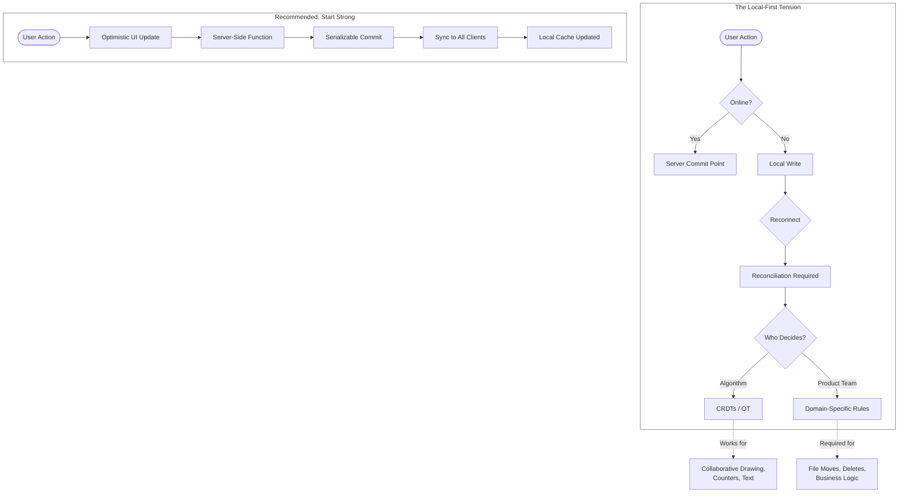

## Timestamps

| Time  | Topic                                                                               |
| ----- | ----------------------------------------------------------------------------------- |
| 00:00 | Introductions — framing the local-first discourse as a pendulum swing               |
| 04:00 | What "local-first" actually means vs. what people imply by it                       |
| 08:00 | Source of truth, distributed state, forked versions                                 |
| 14:00 | Dropbox conflict resolution — duplicate copies, file moves, asymmetric deletes      |
| 20:00 | Serializability and linearizability explained — why offline writes break guarantees |
| 27:00 | User intent as product design — reconciliation as a human problem                   |
| 33:00 | Caching vs. sync — optimistic updates and commit points                             |
| 39:00 | LAN sync at Dropbox — commit points and transactions                                |
| 45:00 | Firebase as cautionary tale — Arc security incident — RPC vs. direct DB access      |
| 50:00 | Closing — sync vs. RPC is a false choice                                            |

## Key Arguments

### "Local-First" Is Mostly Rhetorical

Almost nobody truly believes the client should be the authoritative source of truth — that would mean losing your data when you lose your device. What people actually mean: apps should feel responsive under latency or when offline. The movement is better understood as advocacy for better offline UX, not a philosophical rejection of servers.

This maps directly to what I've been seeing in the local-first community. The label creates confusion between the _product goal_ (responsive, offline-capable) and the _architecture_ (client as source of truth, CRDTs everywhere). [[the-local-first-litmus-test]] tries to untangle exactly this distinction.

### Offline Writes Break Serializability — Mathematically

> "You cannot have serializability if people are in different places at the same time without locking or some kind of optimistic concurrency control... if you allow people to operate purely in disconnected mode you cannot have serializability. It's just a mathematical fact."
> — James Cowling

This isn't a "we haven't solved it yet" situation. It's a fundamental constraint. The moment you allow writes to happen disconnected, no algorithm can guarantee a serial ordering without a centralized commit point. Lamport's "Time, Clocks, and the Ordering of Events" is the foundational paper here.

### Reconciliation Is Product Design, Not Computer Science

Deciding what state converges to after offline divergence requires domain knowledge about user intent. At Dropbox, product managers — not just engineers — made reconciliation decisions. The Dropbox examples are concrete:

- **File deleted + file edited elsewhere** → edit wins, keep the file (asymmetric rule)
- **Folder move creating a cycle** → reject to preserve tree invariant
- **HR folder delete + share operation** → delete must precede share (causal ordering)

Every one of these required a product decision. There's no universal algorithm for "what did the user mean?"

> "Programming in very weak consistency models is just way way too hard... it's one of those things that demos really well but then trying to build a real application with a complex relational data model where you can't reason about any consistency between different rows or objects it just ends up being really really difficult."
> — Sujay Jayakar

This echoes [[crdts-solved-conflicts-not-sync]] — CRDTs handle the merge math beautifully, but the real engineering lives in everything around them.

### Start Strong, Weaken Intentionally

> "It's easier to start with strong guarantees and then in certain situations loosen them than it is to start with weak guarantees and then all of a sudden somehow try to figure out how to add consistency on top of that."
> — James Cowling

Firebase and Arc's security incident are offered as evidence. Exposing your database directly to clients — even with row-level security — is the wrong abstraction. Cowling's analogy: you don't talk to a library's internal variables, you talk to its API.

::

### Sync and RPC Are Complementary, Not Competing

The false dichotomy of "sync engine vs. traditional server" misses the point. The right model: server-side functions handle business logic with access controls, results sync to clients via subscriptions, local cache gives instant UI. Most writes commit to the server immediately. Offline capability gets layered on _intentionally_, for specific use cases, with explicit commit points.

The "commit point" concept is the key mental model here. It's the precise moment an operation transitions from "not happened" to "happened." Dropbox's LAN sync optimization illustrates this beautifully — they'd send file chunks peer-to-peer over the local network _before_ the server commit completed, making it feel impossibly fast while keeping the server as the real source of truth.

## Notable Quotes

> "I think when people say local first in many respects they're saying it for effect... very few people truly believe local first."
> — James Cowling

> "For me I think of sync as being distributed state management... we all know that multi-threaded concurrent programming is really hard."
> — Sujay Jayakar

> "Exposing your database to have clients directly talk to your database — it's just a bad model... normally if you talk to a library you don't talk to the variables inside the library, you talk to the API of the library."
> — James Cowling

## Connections

- [[a-map-of-sync]] — Sujay Jayakar's written taxonomy of the sync design space, the article version of the mental models discussed here. Nine dimensions for mapping where any sync platform sits
- [[crdts-solved-conflicts-not-sync]] — Adam Fish arrives at the same conclusion from the practitioner side: CRDTs solve merge conflicts, but transport, compression, and distributed deletes are the harder problems
- [[the-local-first-litmus-test]] — Alexander's own framework for distinguishing genuinely local-first apps from fast cloud apps with local caches — exactly the distinction Cowling argues most people conflate
- [[local-first-software-pragmatism-vs-idealism]] — Adam Wiggins frames local-first as a movement needing both idealists and pragmatists. This episode is firmly in the pragmatist camp
