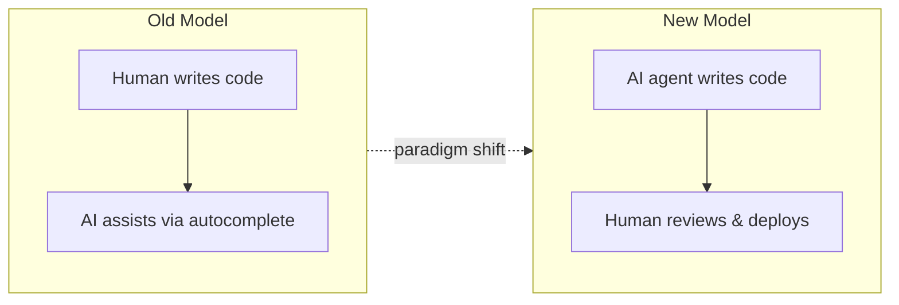

## Summary

Amp is discontinuing its Tab completion feature by the end of January 2026. The company argues that the development paradigm has fundamentally shifted: AI agents, not humans, now generate most production code.

## Key Points

- **"Amp writes 90% of what we ship"** — The team's own workflow proves the shift. Manual code writing has become a minor part of their development process.

- **The original premise is broken.** Tab completion assumed humans write most code with AI assistance. That assumption no longer holds.

- **The real bottleneck changed.** Speed of code output matters less than speed of code review and deployment. Developers now spend more time validating what agents produce than typing.

- **Strategic pivot to post-agentic tools.** Amp recommends alternatives (Cursor, Copilot, Zed) for users who still need inline completion, while the company focuses on agent-first development.

## The Paradigm Shift

::

## Connections

- [[ai-codes-better-than-me-now-what]] — Lee Robinson describes the same shift: AI agents have surpassed his coding ability, and the bottleneck moved from writing code to building great products
- [[front-end-engineering-is-dead-long-live-front-end-composability]] — Another "X is dead" argument about AI transforming how developers work, shifting focus from hand-coding to designing composable systems
