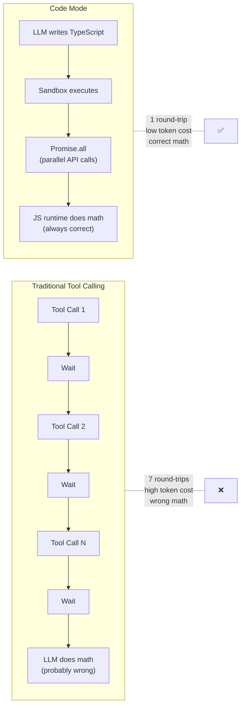

## Summary

The core insight is embarrassingly obvious once you see it: LLMs are great at writing TypeScript and terrible at math and sequential orchestration. So stop asking them to call tools one at a time. Give them an `execute_typescript` tool, let them write a program that composes your tools, and run it in a sandboxed isolate. Seven tool calls become one. Mental math becomes `Array.reduce()`. The N+1 problem disappears.

TanStack AI's Code Mode packages this pattern into a composable, model-agnostic tool. Define your tools with `toolDefinition()`, pick an isolate driver (Node V8, QuickJS WASM, or Cloudflare Workers), and the LLM gets a TypeScript sandbox where your tools appear as typed `external_*` functions.



## Key Concepts

### The Three Premises

1. **Tool calling is slow and expensive** — every round-trip bloats the context window, and the overhead compounds
2. **LLMs can't do math** — "the average is 4.37" is pattern matching, not computation
3. **LLMs are excellent at TypeScript** — enormous training data, they know `Promise.all`, `.reduce()`, async control flow

The conclusion: let models write code, let runtimes execute it.

### Isolate Drivers

Three runtime options, same `IsolateDriver` interface:

| Driver                            | Best for                    | Native deps     | Browser |
| --------------------------------- | --------------------------- | --------------- | ------- |
| `@tanstack/ai-isolate-node`       | Server-side Node.js         | Yes (C++ addon) | No      |
| `@tanstack/ai-isolate-quickjs`    | Browsers, edge, portability | None (WASM)     | Yes     |
| `@tanstack/ai-isolate-cloudflare` | Edge on Cloudflare          | None            | N/A     |

Each execution creates a fresh sandbox context with configurable timeouts and memory limits. The sandbox is destroyed after every call — no state leaks between executions.

### Skills: Persistent Learned Code

The most interesting extension. When the LLM writes code that works, it can save it as a **skill** — a named, typed, persistent function. Next conversation, relevant skills load automatically (selected by a cheap model) and appear as direct tools. The LLM calls them without rewriting the logic.

Skills earn trust through execution stats. Four strategies from "always trusted" to custom thresholds. Trust is metadata-only today, but the infrastructure is there for approval workflows.

## Code Snippets

### Basic Setup

```typescript
import { createCodeMode } from "@tanstack/ai-code-mode";
import { createNodeIsolateDriver } from "@tanstack/ai-isolate-node";

const { tool, systemPrompt } = createCodeMode({
  driver: createNodeIsolateDriver(),
  tools: [fetchWeather],
  timeout: 30_000,
});
```

### With Skills

```typescript
import { codeModeWithSkills } from "@tanstack/ai-code-mode-skills";
import { createFileSkillStorage } from "@tanstack/ai-code-mode-skills/storage";

const storage = createFileSkillStorage({ directory: "./.skills" });
const { toolsRegistry, systemPrompt } = await codeModeWithSkills({
  config: { driver: createNodeIsolateDriver(), tools, timeout: 60_000 },
  adapter: openaiText("gpt-5.4-mini"),
  skills: { storage, maxSkillsInContext: 5 },
  messages,
});
```

## Connections

- [[building-ai-agentic-apps-in-2025]] — Sunil Pai's talk on Cloudflare's agent framework is the direct predecessor here. He pushed the idea that agents should generate TypeScript against typed SDKs instead of making individual tool calls. TanStack Code Mode packages that insight into a composable library.
