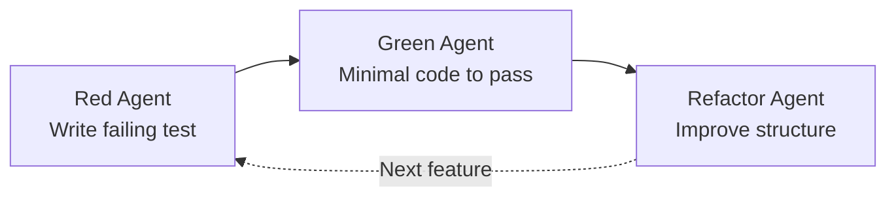

## Summary

GitHub Copilot's agent mode in VS Code can enforce test-driven development discipline through custom agent configurations. The approach creates three specialized agents—one for each TDD phase—with explicit handoff rules that prevent the common pitfall of skipping straight to implementation.

## The TDD Cycle with AI Agents

The traditional Red-Green-Refactor cycle gains structure when each phase has a dedicated agent with constrained permissions.



::

## Key Concepts

- **Red phase agent**: Writes tests that initially fail, establishing requirements before any implementation exists
- **Green phase agent**: Creates minimal code to make tests pass—explicitly avoids over-engineering
- **Refactor phase agent**: Improves code quality while maintaining passing tests
- **Handoff mechanism**: Agents transfer control explicitly, preventing phase-skipping

## Agent Configuration

Each agent gets a dedicated markdown file defining its behavior and available tools.

### TDD Red Agent

```markdown
# TDD-red.agent.md

"Write the minimal code change needed so that the test passes"

Tools: read, edit, search
Handoff: → TDD-green when test written
```

### TDD Green Agent

```markdown
# TDD-green.agent.md

Implements changes then runs tests automatically

Tools: read, edit, execute
Handoff: → TDD-refactor when tests pass
```

### Testing Guidelines

The guide recommends establishing testing standards in a custom instructions file. Key patterns:

- **Arrange-Act-Assert**: Structure every test with clear setup, action, and verification sections
- **Independent tests**: Each test should run in isolation without depending on others
- **Behavior focus**: Test what the code does, not how it does it

## Connections

- [[copilot-sdk]] - The programmatic interface for building Copilot integrations, which these custom agents build upon
- [[how-to-build-a-coding-agent]] - Explains the fundamental agent loop pattern that these TDD agents implement
