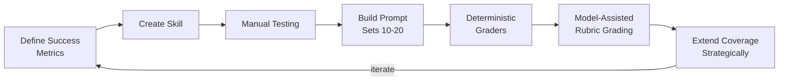

## The Problem

Most developers ship agent skills based on gut feel. You prompt it a few times, it looks good, you ship. Then it silently degrades — a model update, a context change, a slightly different phrasing — and you have no idea because there's no baseline to compare against.

This guide from OpenAI's DevEx team lays out a systematic approach: treat skill validation like testing, not like prayer.

## The Eval Formula

An eval boils down to one equation:

> A prompt → a captured run (trace + artifacts) → a small set of checks → a score you can compare over time.

That's it. No complex infrastructure required. The insight is that you don't need perfect grading — you need _consistent_ grading across iterations.

## The 7-Step Process

**1. Define success metrics first.** Before writing the skill, establish what "working" means across four categories: outcome (did it complete?), process (right tools invoked?), style (conventions followed?), and efficiency (no unnecessary steps?).

**2. Create the skill.** A directory with a `SKILL.md` containing YAML front matter and markdown instructions. Their example scaffolds a Vite + React + Tailwind app.

**3. Manual testing exposes hidden assumptions.** Explicitly trigger skills to surface what you assumed about activation conditions, environment requirements, and execution order.

**4. Build small prompt sets.** 10-20 test cases in CSV covering: explicit invocation, implicit triggering, contextual requests, and negative controls (when the skill _shouldn't_ fire).

**5. Deterministic graders via traces.** Use `codex exec --json` to capture structured event traces, then write lightweight checks for observable behaviors — command execution, file creation, specific outputs.

**6. Model-assisted rubric grading.** For qualitative stuff (code style, architecture quality), use `--output-schema` to constrain responses to structured JSON. Let a model grade against a rubric consistently.

**7. Extend coverage strategically.** Layer heavier checks only where they reduce meaningful risk: command/token counting, build validation, runtime smoke tests, repo cleanliness.

::

## What Makes This Different

The negative controls idea stands out. Most people test that their skill works when invoked — few test that it stays _quiet_ when it shouldn't activate. That's the fragility Vercel found with skills firing (or not firing) unpredictably.

The layered grading approach is pragmatic too. Start with deterministic checks (did the file get created?), graduate to model-assisted rubric grading only for things you can't check mechanically. Don't over-invest in evaluation infrastructure before you know what breaks.

## Connections

- [[agents-md-outperforms-skills-in-vercel-agent-evals]] — Vercel found skills failed to activate 56% of the time in evals. This guide addresses exactly that problem with negative controls and systematic prompt set design.
- [[essential-ai-coding-feedback-loops-for-typescript-projects]] — Matt Pocock's feedback loops (TypeScript, Vitest, Husky) are the runtime equivalent of what this article proposes for skill-level evaluation — mechanical verification that agents did the right thing.
- [[fitness-function-driven-architecture-and-agentic-ai]] — Neal Ford's fitness functions enforce architectural intent mechanically. Evals are the same idea applied to agent behavior: define what "correct" looks like, then check it automatically.
