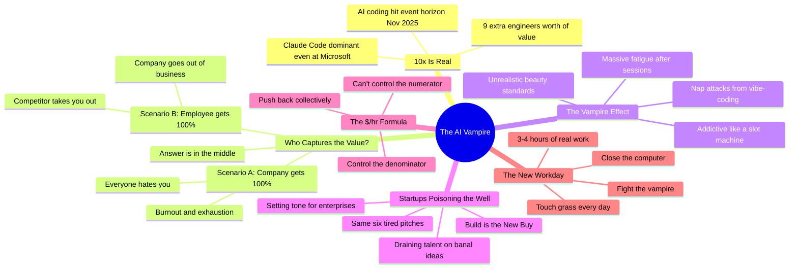

Yegge's been one of the loudest evangelists for AI coding — co-wrote a book on it, runs multiple Claude Max accounts, vibe-codes for hours. And now he's writing a post that says: this thing is killing us. That tension is what makes the argument land.

The core insight isn't that AI makes you tired (obvious). It's the **value capture problem**: if AI makes you 10x productive, that surplus value has to go somewhere, and the fight over who gets it is destroying people on both sides.

::

## Key Points

- **Value capture is a spectrum** — In Scenario A, the employer captures 100% of your AI productivity gains and you burn out. In Scenario B, you slack off and the company dies. Neither extreme works. The answer lives in the middle, and nobody knows exactly where the dial should be.
- **AI coding is addictive by design** — It works like a slot machine: pull a lever (prompt), get random rewards and occasional amazing payouts. The dopamine loop erodes boundaries between work and rest. Yegge describes falling asleep suddenly throughout the day after long sessions.
- **Unrealistic beauty standards** — Outliers like Yegge (40 years experience, unlimited time, unlimited tokens) post about 40-hour coding sprints and employers think that's the baseline. Dollar-signs appear in their eyeballs like cartoon bosses.
- **Startups are the worst offenders** — An army of hopeful founders chasing the same six tired pitches (agent sandboxes, AI personas, better RAG). Most won't sell a dollar of ARR. "Build is the New Buy" will kill SaaS contracts, but the gold rush mentality persists.
- **The $/hr formula** — From Yegge's Amazon days circa 2001: you can't control the numerator (salary), but you can control the denominator (hours). The same formula applies now. Collectively, employees have all the power — CEOs have surprisingly little.
- **The new workday is 3-4 hours** — AI turns everyone into Jeff Bezos: all the easy work is automated, leaving only difficult decisions and problem-solving. That pace isn't sustainable for 8 hours. Give people unlimited tokens but expect real cognitive work in short bursts.

## The Honest Part

Yegge takes accountability for being part of the problem — setting unrealistic standards, telling everyone to work like him, co-writing books about it. He's now actively dialing back: saying no to meetings, resisting podcast appearances, and typing this post at the mall while his family waits to go for a walk. That self-awareness from someone this deep in the AI hype cycle is rare.

## Connections

- [[ai-doesnt-reduce-work-it-intensifies-it]] — Willison cites the research that proves Yegge's intuition: AI doesn't lighten workloads, it creates compulsive task-stacking loops. Yegge's "vampire" metaphor is the visceral version of what Ranganathan and Ye measured empirically
- [[your-startup-idea-is-their-weekend-holiday]] — Klinger describes the SaaS compression from the founder side; Yegge warns about the same startup frenzy from the burnout side — founders draining teams in pursuit of instantly replaceable ideas
- [[ai-is-a-high-pass-filter-for-software]] — Finster argues AI amplifies existing capability. Yegge asks the uncomfortable follow-up: amplified productivity for whom? The value capture question is what Finster's "high-pass filter" analysis misses
