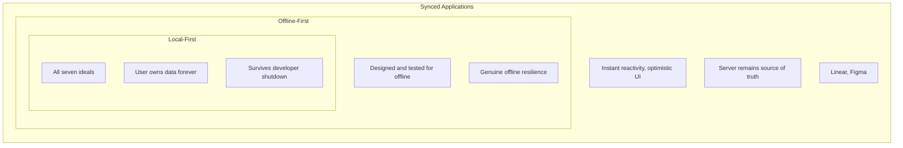

## Overview

Three of the four original [[local-first-software]] essay authors (Kleppmann, Wiggins, van Hardenberg) sit on a panel with Aaron Boodman (Rocicorp/Zero) — and the result is the most honest airing of internal tensions in the local-first community. The central question isn't about CRDTs or sync protocols. It's about values: is local-first a technology choice or a moral commitment to users?

## Aaron's Concentric Circles

The most useful framework from the discussion. Aaron proposes three rings to classify apps that use sync engines:

::

Most developers using Zero today sit in the outer ring — they want instant UI, not offline resilience. That's fine, Aaron argues. The inner ring is the aspiration, not the entry requirement.

## The Offline Writes Debate

This is where the panel gets heated. Aaron temporarily disabled offline writes in Zero, and the reactions split perfectly along ideological lines:

**Boodman's position:** CRDTs give developers a false sense of safety. Two concurrent edits to the same paragraph produce "consistent but nonsensical" results — text that neither user typed. The longer someone is offline, the more work they invest _and_ the higher the chance of destructive merges. A cruel double whammy.

**Kleppmann's position:** Blocking a user from editing their document on a train is patronizing. If you're the sole editor, there's zero conflict risk. The solution isn't to remove the capability — it's to build version-control UX (branching, diffing, review) for structured data, the way developers already do with Git.

**Van Hardenberg (mediating):** Both are right at different layers. Ink & Switch built Patchwork — a prototype that gives rich documents pull-request-style review. The branching approach makes offline tractable without pretending auto-merge solves everything.

## AI and Local-First: Complementary, Not Conflicting

Van Hardenberg had the sharpest framing here, citing Geoffrey Litt: "AI collaboration is a version control problem." When an agent edits a 17,000-word document, you need the same branching and diff primitives you use for code. Local-first's change-tracking capabilities fit naturally.

On the centralization fear — van Hardenberg argued it's already fading. DeepSeek proved you can train cheaply by drafting off existing work. Unified memory architectures are putting 64-256 GB of usable GPU RAM on consumer devices. Capable models will ship with your OS within a few years.

## Notable Quotes

> "For me, sync engines are a particular technology. Local first for me is a value, and that value is empowering users."
> — Martin Kleppmann

> "I sometimes tell people that working on CRDTs is my penance for creating a million single points of failure by running all those Heroku Postgres databases."
> — Peter van Hardenberg

> "I've experienced a product that works really well offline like five or less times in my life."
> — Aaron Boodman

> "Stopping the user from editing their document on the train — it's almost patronizing."
> — Martin Kleppmann

## The Deeper Tension

What makes this panel fascinating is that the disagreement maps to a fundamental question: **who is your primary stakeholder?**

Kleppmann optimizes for the end user — their agency, their data, their freedom. Boodman optimizes for the developer — ship tools that work reliably, don't moralize about what gets built. Van Hardenberg mediates — protective of the essay's ideals but welcoming the broad community.

This mirrors exactly the idealist vs. pragmatist framing from [[local-first-software-pragmatism-vs-idealism]], except here it's not abstract — it's three people who deeply respect each other disagreeing in real time about whether ideals should constrain shipping decisions today.

## Connections

- [[local-first-software]] — The foundational essay co-authored by three of the four panelists. Every argument in this panel traces back to whether the seven ideals are a north star or a shipping requirement
- [[sync-panel-discussion]] — The companion panel at the same conference where Aaron Boodman debates sync architecture with different panelists (Cowling, Schickling, Mathews). That panel is about _how_ to build sync; this one is about _why_
- [[local-first-software-pragmatism-vs-idealism]] — Adam Wiggins' solo talk articulating the idealist-pragmatist spectrum. This panel is the live version of that tension, with Kleppmann and Boodman embodying opposite poles
- [[the-past-present-and-future-of-local-first]] — Kleppmann's keynote at the same conference where he proposes the definition that software must survive its creator's shutdown. His position in this panel is the debate-ready version of that definition
