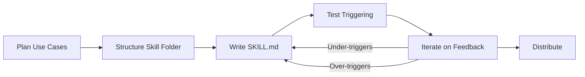

## Summary

Anthropic's official guide (30+ pages) covers the complete lifecycle of building skills for Claude: planning use cases, structuring the skill folder, writing effective frontmatter and instructions, testing for triggering accuracy, and distributing skills to users or organizations. The guide positions skills as the knowledge layer that sits on top of MCP's connectivity layer—MCP gives Claude access to tools, skills teach Claude how to use them well. Expect 15–30 minutes to build and test a first working skill using the built-in `skill-creator` tool.

## Core Architecture

### Progressive Disclosure

Skills operate on three loading levels to minimize token usage while preserving depth:

1. **YAML frontmatter** — always loaded into context; determines whether the skill activates
2. **SKILL.md body** — loaded only when the skill is triggered as relevant
3. **Linked reference files** — discovered and loaded on demand during execution

### Three Design Principles

- **Progressive disclosure** — load only what's needed, when it's needed
- **Composability** — skills work alongside other capabilities, never assuming exclusivity
- **Portability** — identical functionality across Claude.ai, Claude Code, and the API

### The Kitchen Analogy

MCP provides the professional kitchen (tools, ingredients, equipment). Skills provide the recipes (step-by-step workflows). Together they let users accomplish complex tasks without figuring out every step themselves. Without skills, users connect but don't know next steps; with skills, pre-built workflows activate automatically with best practices embedded.

## Skill Structure

### Required Folder Layout

```text
your-skill-name/
├── SKILL.md              # Required — exact name, case-sensitive
├── scripts/              # Optional executables
│   ├── process_data.py
│   └── validate.sh
├── references/           # Optional documentation
│   ├── api-guide.md
│   └── examples/
└── assets/               # Optional templates, icons
    └── report-template.md
```

### Non-Negotiable Rules

- Folder name: **kebab-case** only (no spaces, capitals, underscores)
- File must be exactly `SKILL.md` (case-sensitive)
- No `README.md` inside the skill folder
- No XML brackets (`<` or `>`) anywhere in YAML
- Name cannot contain "claude" or "anthropic"

### YAML Frontmatter Reference

```yaml
---
name: skill-name-in-kebab-case # Required, matches folder name
description: > # Required, under 1024 chars
  What it does. Use when [trigger phrases].
license: MIT # Optional
compatibility: Environment requirements # Optional, 1-500 chars
allowed-tools: "Bash(python:*) WebFetch" # Optional
metadata: # Optional
  author: Company Name
  version: 1.0.0
  mcp-server: server-name
  category: productivity
  tags: [automation, workflow]
---
```

The **description field is the most important part** — it determines whether Claude loads the skill. It must include both what the skill does and when to use it, with specific trigger phrases users would actually say.

**Good**: "Analyzes Figma design files and generates developer handoff documentation. Use when user uploads .fig files, asks for 'design specs', 'component documentation', or 'design-to-code handoff'."

**Bad**: "Helps with projects."

## Three Skill Categories

1. **Document & Asset Creation** — consistent output generation using style guides and templates without external tools (e.g., frontend design, presentations)
2. **Workflow Automation** — multi-step processes with validation gates and improvement loops (e.g., sprint planning, onboarding)
3. **MCP Enhancement** — workflow guidance layered on top of MCP tool access, coordinating multiple calls with domain expertise

## Five Workflow Patterns



::

1. **Sequential workflow orchestration** — explicit step ordering with dependencies, validation at each stage, and rollback instructions. Example: customer onboarding that chains create_customer → setup_payment → create_subscription → send_email, with each step depending on the prior output.

2. **Multi-MCP coordination** — workflows spanning multiple services with clear phase separation and data passing between phases. Example: design-to-dev handoff flowing through Figma MCP (export) → Drive MCP (storage) → Linear MCP (tasks) → Slack MCP (notification).

3. **Iterative refinement** — draft-validate-improve loops with explicit quality criteria and termination conditions. Pattern: generate initial draft → run validation script → identify issues → refine → re-validate → repeat until threshold met.

4. **Context-aware tool selection** — decision trees that route to different tools based on input characteristics. Example: file storage routing by type and size to cloud storage, Notion, GitHub, or local storage.

5. **Domain-specific intelligence** — embedding specialized knowledge (compliance rules, best practices, risk assessment) directly into the workflow logic. Example: payment processing with sanctions-list checks and jurisdiction validation before any transaction call.

## Success Criteria

### Quantitative Metrics

- Skill triggers on **90% of relevant queries** (test with 10–20 queries)
- Completes workflow in X tool calls (compare with and without skill)
- **Zero failed API calls** per workflow (monitor MCP logs)

### Qualitative Metrics

- Users don't need prompts about next steps
- Workflows complete without user correction
- Consistent results across sessions

## Three-Level Testing Strategy

1. **Triggering tests** — does the skill load for the right queries and stay silent for unrelated ones? Test with obvious phrases, paraphrased requests, and negatives.
2. **Functional tests** — does it produce correct outputs with successful API calls? Cover valid outputs, error handling, and edge cases.
3. **Performance comparison** — compare with-skill vs. without-skill on back-and-forth message count, failed API calls, and total token consumption.

The guide recommends iterating on a single challenging task until Claude succeeds, then extracting the winning approach into a skill. The built-in `skill-creator` tool helps generate properly formatted skills, suggest trigger phrases, and flag triggering risks.

## Troubleshooting

| Problem                                 | Cause                 | Fix                                                                                                                               |
| --------------------------------------- | --------------------- | --------------------------------------------------------------------------------------------------------------------------------- |
| Won't upload: "Could not find SKILL.md" | Wrong filename        | Rename to exactly `SKILL.md` (case-sensitive)                                                                                     |
| Won't upload: "Invalid frontmatter"     | YAML formatting       | Check `---` delimiters, unclosed quotes                                                                                           |
| Won't upload: "Invalid skill name"      | Spaces or capitals    | Use kebab-case only                                                                                                               |
| Never triggers                          | Vague description     | Add specific trigger phrases and file types                                                                                       |
| Triggers too often                      | Scope too broad       | Add negative triggers, narrow scope: not "processes documents" but "processes PDF legal documents"                                |
| Instructions ignored                    | Too verbose or buried | Keep SKILL.md under 5,000 words; move detail to `references/`; put critical rules at top                                          |
| MCP calls fail                          | Connection or naming  | Verify MCP server shows "Connected"; tool names are case-sensitive; test MCP independently                                        |
| Inconsistent results                    | Ambiguous language    | Use specifics with examples; bundle validation scripts for critical checks — code is deterministic, language interpretation isn't |

## Distribution

### Individual Users

Upload via **Settings → Capabilities → Skills** in Claude.ai, or place directly in Claude Code's skills directory.

### Organization-Level (since December 2025)

Admins deploy skills workspace-wide with automatic updates and centralized management. All users in the workspace receive the skill without manual installation.

### Recommended Distribution Strategy

1. Host on GitHub with clear README, example usage, and screenshots
2. Link skills from MCP server documentation
3. Provide installation guide with test command
4. Position on outcomes: "Set up complete workspaces in seconds instead of 30 minutes"

### API Access

The `/v1/skills` endpoint supports listing, managing, and adding skills to the Messages API via the `container.skills` parameter. Works with the Claude Agent SDK for production-at-scale and automated pipelines.

## Instruction Writing Best Practices

- Be specific: not "validate the data" but "Run `python scripts/validate.py --input {filename}`"
- Include error handling with specific error codes and solutions
- Reference bundled resources: "Before writing queries, consult `references/api-patterns.md`"
- Keep SKILL.md under 5,000 words; link to `references/` for depth
- For critical validations, bundle a script — code is deterministic, language interpretation isn't
- Add "Take your time" or "Quality over speed" for thoroughness on complex workflows

## Connections

- [[claude-code-skills]] - The official Skills documentation this guide expands on with deeper patterns and troubleshooting
- [[claude-code-2-1-skills-universal-extension]] - Explores how skills evolved into Claude Code's unified extension mechanism
- [[how-we-built-a-company-wide-knowledge-layer-with-claude-skills]] - A real-world case study of building institutional knowledge distribution with the skill patterns described in this guide
- [[self-improving-skills-in-claude-code]] - How skills can evolve through usage feedback, complementing this guide's iteration methodology
