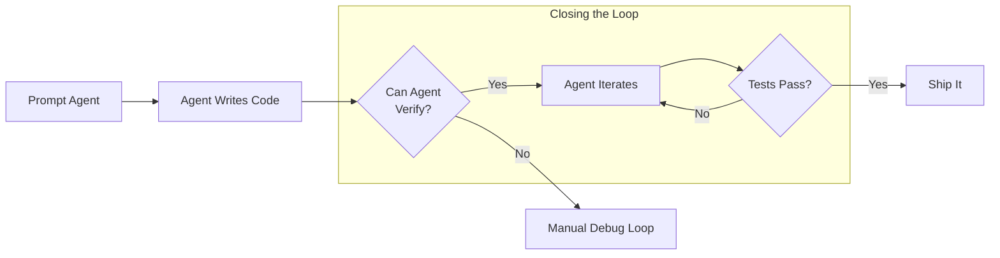

## Context

Peter Steinberger, creator of PSPDFKit (PDF framework on 1+ billion devices) and now Claudbot, returns to tech after a 3-year burnout recovery. He merges 600 commits in a single day and doesn't read most of the code—a claim that sounds reckless until he explains his verification system. The conversation covers his origin story, burnout, and his current AI-assisted workflow.

## Timestamps

| Time    | Topic                                                                  |
| ------- | ---------------------------------------------------------------------- |
| 00:00   | Introduction — 600 commits, not reading code                           |
| 03:00   | Peter's origin story in rural Austria                                  |
| 08:00   | First iOS app — parsing a dating site's HTML                           |
| 15:00   | PSPDFKit beginnings — selling PDF code from a WordPress template       |
| 25:00   | Building PSPDFKit into a company — culture and technical blog strategy |
| 35:00   | Burnout and 3-year hiatus                                              |
| 45:00   | Return to coding — discovering Claude Code in April                    |
| 55:00   | "Closing the loop" — the key principle                                 |
| 1:05:00 | Parallel agents and the Starcraft analogy                              |
| 1:15:00 | Codex vs Claude Code — different strengths                             |
| 1:25:00 | Why experienced devs struggle with AI coding                           |
| 1:35:00 | Claudbot origins — a personal assistant that wakes him up              |

## Key Arguments

### Closing the Loop (55:00)

The difference between frustrating "vibe coding" and effective agentic coding is whether the AI can verify its own work. If you build a CLI alongside your app that exercises the same code paths, the agent can iterate until tests pass. Peter structures every project for fast automated feedback—even building CLI wrappers for Mac apps so the agent doesn't need to click through UI.

> "That's the whole reason why those models are so good at coding but mediocre at creative writing—code I can compile, lint, execute, and verify the output."

### Parallel Agents as Mental Model (1:05:00)

Peter runs 5-10 Codex agents simultaneously across projects. He describes it like playing Starcraft: main base plus satellite bases that generate resources. When one agent finishes a 40-minute task, he reviews and moves to the next. Flow state requires massive parallelization—you can't babysit one slow agent.

### Why Senior Developers Struggle (1:25:00)

People who love solving hard algorithmic problems are most disrupted—that's exactly what AI does well. Developers who see themselves as builders, caring more about product outcomes than implementation elegance, adapt faster. Having managed teams before helps: you already learned to accept "good enough" code from others and iterate.

### Architecture Over Code Reading (1:35:00)

Peter rarely reads individual lines anymore. He watches the agent's output stream and inspects key parts. What matters is system architecture: designing for verifiability, knowing which parts are interesting versus "boring plumbing" (data transformation through API → database → UI).

> "I write better code now that I don't write code myself anymore."

## The "Builder" Workflow

Peter's current approach:

1. **Conversation first** — Discuss options with the model before saying "build." Trigger words matter: "let's discuss" prevents premature execution.
2. **Parallel execution** — Queue tasks across 5-10 agents, review results, repeat.
3. **CLI for everything** — Even GUI apps get CLI wrappers so agents can test without clicking through UI.
4. **Tests as verification** — Every feature includes tests the agent runs itself.
5. **Never revert** — Iterate direction through conversation instead of git reset.

## Diagram

The core principle distinguishing effective agentic coding from frustrating attempts:

::

## On Burnout and Recovery

Peter burned out after 13 years building PSPDFKit. The cause wasn't just long hours—it was working on something he no longer believed in, combined with management conflicts and being the "waste bin" for problems nobody else could solve. Recovery took 3 years of not touching a computer some months.

The return to coding came through a side project idea he'd shelved. When he saw Claude Code in April, the friction of learning web development (which he'd never done hands-on) disappeared. "I never had a community blowing up so fast" — Claudbot became the outlet for his re-energized building instinct.

## Notable Quotes

> "I ship code I don't read... but I care a lot about structure. Did I read all the 15,000 lines in that PR? No, because a lot of code is just boring plumbing."

> "Building software is like walking up a mountain. You don't go straight up—you circle around it and take turns."

> "To me, those models are ghosts of our collective human knowledge. They work similar to us in many ways—of course you don't get it right the first time."

> "VIP coding starts at 3 a.m."

## Connections

- [[shipping-at-inference-speed]] — Peter's blog post covering the same themes: watching streams instead of reading code, stack selection for AI friendliness, and documentation as memory
- [[im-done-jeffrey-way-on-ai-and-coding]] — Jeffrey Way describes a similar transformation: bugs that took half a day now take five minutes, and the puzzle shifted from writing if-statements to orchestrating agents
