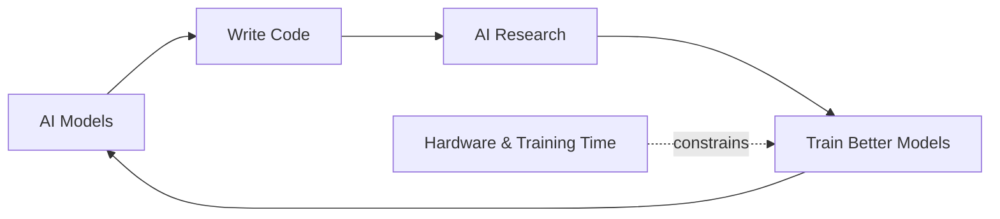

## Overview

Dario Amodei (Anthropic) and Demis Hassabis (Google DeepMind) debate AGI timelines and implications at Davos 2026. While they differ on timing—Dario sees 1-2 years, Demis 5-10—both agree we're approaching a transformative threshold that humanity may not be prepared for.

## Key Arguments

### The Self-Improvement Loop Is Closing

Dario describes the mechanism driving AGI: AI models that excel at coding and AI research create a feedback loop that accelerates development.

> "We are now in terms of the models that write code... I have engineers within Anthropic who say I don't write any code anymore, I just let the model write the code."
> — Dario Amodei

The loop isn't fully closed yet—hardware manufacturing and training time impose limits—but Dario believes "something fast is going to happen."

### Missing Capabilities May Slow Progress

Demis offers a more cautious view, pointing to gaps in current systems:

- **Verification difficulty**: Coding and math are easier to automate because outputs are verifiable. Scientific predictions may require physical experiments.
- **Hypothesis generation**: Current models solve existing problems but struggle to formulate new questions or theories.
- **Physical AI**: Robotics and embodied intelligence remain unsolved.

> "I think there may be one or two missing ingredients... It remains to be seen if self-improvement can close without human in the loop."
> — Demis Hassabis

### Job Displacement Is Coming Fast

Both leaders see labor market disruption accelerating:

- Dario: "Half of entry-level white collar jobs could be gone within 1-5 years"
- Impact already visible in software engineering hiring
- Anthropic itself is adjusting headcount projections downward
- The labor market's adaptability may be overwhelmed by exponential AI improvement

Demis advises current students to "get unbelievably proficient with these tools"—the capability overhang in today's models is underexplored.

### Geopolitics Complicates Safety

Dario frames the chip export debate starkly:

> "I think of this more as... are we going to sell nuclear weapons to North Korea because that produces some profit for Boeing?"
> — Dario Amodei

The US-China competition prevents coordinated slowdown. Even if safety concerns warrant more time, unilateral restraint is unenforceable. Both leaders agree international minimum safety standards are needed but acknowledge current geopolitics makes this unlikely.

### The Technological Adolescence Frame

Dario previews his upcoming essay on AI risks, framed around Carl Sagan's _Contact_: "How did you get through this technological adolescence without destroying yourselves?"

Key risk categories:

- **Control**: Highly autonomous systems smarter than humans
- **Individual misuse**: Bioterrorism, weapons
- **State misuse**: Authoritarian deployment
- **Economic disruption**: Job displacement at unprecedented scale
- **Unknown unknowns**: What we haven't imagined

## Self-Improvement Loop

::

## Practical Takeaways

- The window for preparation is narrower than most assume—plan career moves accordingly
- Get deeply proficient with AI tools now; the capability overhang is real
- Watch for the self-improvement loop to close—that's the acceleration point
- International coordination on AI safety is essential but currently absent
- Post-AGI economics may require new institutions for distributing productivity gains

## Notable Quotes

> "If I had to guess, I would guess that this goes faster than people imagine."
> — Dario Amodei

> "We may be in a post-scarcity world, but there are even bigger questions than that to do with meaning and purpose."
> — Demis Hassabis

> "It's for us to write as humanity what's going to happen next."
> — Demis Hassabis on the Fermi paradox
