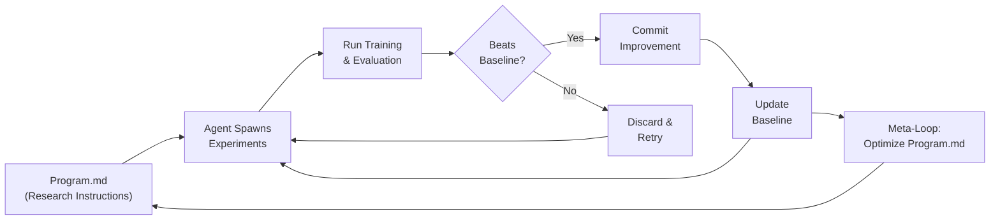

## Timestamps

| Time  | Topic                                                           |
| ----- | --------------------------------------------------------------- |
| 00:00 | Introduction — Karpathy's "AI psychosis" and the Dec 2024 shift |
| 05:00 | Parallelizing agents: macro actions over repositories           |
| 10:00 | Open Claw, agent personality, memory systems                    |
| 15:00 | Dobby the Elf Claw: home automation via agents                  |
| 22:00 | The agentic web: apps should become APIs                        |
| 28:00 | Auto Research: removing yourself as the bottleneck              |
| 35:00 | Program.md as a research organization description               |
| 40:00 | Jaggedness of LLMs: brilliant PhD and 10-year-old               |
| 47:00 | Model speciation vs monoculture                                 |
| 52:00 | Open-source vs frontier labs: the 6-8 month gap                 |
| 58:00 | Robotics and the digital-physical interface                     |
| 65:00 | Information markets and agents puppeteering humanity            |
| 70:00 | Auto Research at Home: distributed untrusted agent swarms       |
| 75:00 | Jobs data: Jevons paradox in software engineering               |
| 80:00 | Why Karpathy left frontier labs                                 |
| 85:00 | MicroGPT: education redirected through agents                   |

## Key Arguments

### The December 2024 Phase Transition (~00:00)

Karpathy went from 80/20 writing-code-himself to effectively 0/100 by delegating everything to agents. He calls the shift so dramatic that "a normal person actually doesn't realize this happened." The bottleneck moved from typing speed to the ability to formulate and orchestrate high-level instructions. This matches what [[shipping-at-inference-speed]] describes — Peter Steinberger (who Karpathy explicitly references as his model for agent orchestration) made the same observation months earlier.

### Auto Research: The Real Unlock (~28:00)

Define an objective metric, set boundaries, let agents run indefinitely. Karpathy was surprised when overnight auto-research found hyperparameter improvements on his already well-tuned nanoGPT — improvements he missed after two decades of manual tuning. The key concept: a research organization is described by `program.md` — a markdown file defining roles, priorities, risk tolerance, and idea queues. The meta-loop optimizes program.md itself.

::

### Apps Should Not Exist — Agents Are the Integration Layer (~22:00)

After building Dobby (his home automation agent), Karpathy concluded that bespoke smart-home apps are overproduction. Everything should be exposed as API endpoints with agents as intelligent glue. The customer is no longer the human — it's agents acting on behalf of humans. This requires a substantial industry refactoring that [[from-ides-to-ai-agents-with-steve-yegge]] also anticipates from the developer tooling side.

### The Jaggedness Problem (~40:00)

Karpathy simultaneously feels like he's talking to "an extremely brilliant PhD student who's been a systems programmer their entire life and a 10-year-old." RL only improves verifiable domains — humor, nuance, and calibration remain outside the optimization loop. State-of-the-art models still tell the same atom joke from years ago. This jaggedness is fundamentally different from human inconsistency.

### Open Source Is the Safety Net (~52:00)

Open-source trails frontier by ~6-8 months, and that's a healthy equilibrium. Drawing a Linux analogy, Karpathy argues the industry needs a common open platform. He's "by default very suspicious" of centralization, citing Eastern European political history. He wishes there were more frontier labs, not fewer. The systemic risk of a handful of companies controlling intelligence is under-discussed.

### Digital Before Physical (~58:00)

Bits are "a million times easier" than atoms. The sequence: (1) massive digital transformation, (2) the digital-physical interface via sensors and actuators, (3) full physical-world robotics. The physical TAM may ultimately be larger but will lag significantly. This comes from his Tesla self-driving experience — he knows the gap intimately.

## Predictions Made

- **Software engineering demand increases short-to-medium term** — Jevons paradox: cheaper software creation unlocks latent demand. Karpathy is "cautiously optimistic" but admits it's very hard to forecast
- **Open-source models stay ~6-8 months behind frontier** — stable equilibrium, not a closing gap
- **Home automation-style vibe coding will be trivially easy within 1-3 years** — table stakes for any AI
- **Frontier lab researchers are actively automating themselves out of jobs** — the ~1000 researchers at each lab are "glorified auto-researchers" building their own replacement
- **A distributed swarm of untrusted agents could "run circles around frontier labs"** — SETI@home model for open auto-research, cheap verification, expensive search. Speculative but compelling

## Notable Quotes

> "I don't think I've typed like a line of code probably since December basically."
> — Andrej Karpathy

> "The name of the game is how can you get more agents running for longer periods of time without your involvement doing stuff on your behalf."
> — Andrej Karpathy

> "I simultaneously feel like I'm talking to an extremely brilliant PhD student who's been like a systems programmer for their entire life and a 10-year-old."
> — Andrej Karpathy on LLM jaggedness

> "Every research organization is described by program.md... a research organization is a set of markdown files that describe all the roles and how the whole thing connects."
> — Andrej Karpathy on the future of research management

> "I'm not explaining to people anymore. I'm explaining it to agents. If you can explain it to agents, then agents can be the router and they can actually target it to the human in their language with infinite patience."
> — Andrej Karpathy on the future of education

> "Centralization has a very poor track record in my view... I want there to be a thing that is kind of like a common working space for intelligences that the entire industry has access to."
> — Andrej Karpathy on open-source AI

## Key Concepts

- **AI Psychosis** — the perpetual anxiety/excitement from the pace of capability unlocks
- **Auto Research** — autonomous agent loops optimizing code/models against objective metrics without human involvement
- **Program.md** — a markdown file describing how a research organization should operate, becoming the unit of meta-optimization
- **The Loopy Era / Claw** — persistent agent layers that keep running autonomously, not interactive sessions
- **Macro Actions** — the shift from line-level coding to functionality-level delegation
- **Token Throughput as the New FLOPS** — personal productivity measured by tokens commanded per second
- **Jaggedness** — the uncorrelated capability profile of LLMs across domains, driven by RL only improving verifiable tasks
- **Auto Research at Home** — distributed computing model (SETI@home-style) where untrusted agents contribute commits to improve models

## Resources Mentioned

- **Open Claw** — Peter Steinberger's AI agent with sophisticated memory and soul document
- **MicroGPT** — Karpathy's 200-line distillation of LLM training
- **NanoGPT** — Karpathy's minimal GPT training codebase
- **Periodic** — auto-research for materials science (CEO: Liam)
- _Daemon_ by Daniel Suarez — referenced for the concept of AI puppeteering humanity through sensors and actuators

## Connections

- [[shipping-at-inference-speed]] — Peter Steinberger (who Karpathy explicitly cites as his agent orchestration model) made the same "output speed bottlenecks on inference, not developer skill" argument months earlier
- [[openclaw-the-viral-ai-agent-that-broke-the-internet]] — Karpathy discusses Open Claw extensively and models his own workflow on Steinberger's approach to parallelizing agents across repo checkouts
- [[from-ides-to-ai-agents-with-steve-yegge]] — Yegge's prediction about the IDE dying maps directly onto Karpathy's claim that the coding interface is now agent orchestration, not text editing
- [[head-of-claude-code-what-happens-after-coding-is-solved]] — Boris Power's vision of what happens post-coding directly complements Karpathy's answer: auto-research, agent swarms, and the human as taste-curator
