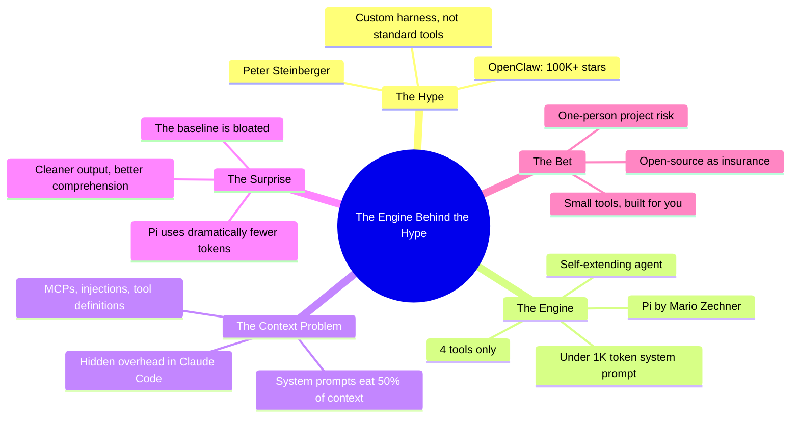

## Summary

Uzunismail traces his journey through every AI coding tool imaginable — ChatGPT, Cursor, Copilot, Windsurf, Augment, the lot — spending $100-150/month before settling on Claude Code. Then he discovers Pi, the minimal agent by Mario Zechner that powers OpenClaw, and realizes the baseline he accepted was bloated all along.

The core insight isn't "Pi is better." It's that system prompts, MCPs, and injected tool definitions silently eat 50% of your context window before you type a single character. Pi proves this by doing more with dramatically less.

## The OpenClaw Connection

Everyone knows OpenClaw — 100K+ GitHub stars, three name changes, a crypto scam during one transition. Peter Steinberger built this viral agent, but Uzunismail dug deeper. Steinberger used a custom harness rather than standard tools, and that harness was Pi. The lobster everyone talks about runs on an engine nobody talks about. That asymmetry — 100K+ stars for the wrapper, 11K for the engine — says something about how we evaluate tools.

## The Context Window Realization

Uzunismail's threshold: flag concern at 70K tokens, wrap sessions at 100K. With Claude Code, system prompts and MCP definitions consumed half his context window before composing a single request. Testing Pi with the same workload revealed a dramatic gap. Token usage dropped, output quality improved, and codebase comprehension felt sharper.

His diagnosis: "That baseline is bloated." MCPs eat tokens, sure, but the gap is too big for that alone. Hidden overhead — system prompts, tool definitions, undisclosed instructions — constitutes a tax you never agreed to pay.

::

## The Minimalism Bet

Four tools. Read, Write, Edit, Bash. Under 1,000 tokens of system prompt. Armin Ronacher's framing captures it: Pi's power comes from "its tiny core and its extension system" — the agent extends itself rather than relying on downloaded plugins.

The trade-off is real — Pi is one person's project. Zechner could walk away tomorrow. But Uzunismail argues the trajectory favors small, personal tools you control over conforming to someone else's product decisions. Open-source provides the insurance: you can always fork.

## Connections

- [[pi-coding-agent-minimal-agent-harness]] - Zechner's own architectural teardown of Pi — the technical foundation for Uzunismail's observations about minimalism and context efficiency
- [[pi-the-minimal-agent-within-openclaw]] - Ronacher's endorsement of Pi, which Uzunismail directly references as validation of the self-extension philosophy
- [[openclaw-the-viral-ai-agent-that-broke-the-internet]] - The other side of this story — OpenClaw's viral success that obscured Pi as the real engine underneath
- [[the-pi-coding-agent-the-only-real-claude-code-competitor]] - IndyDevDan's structural comparison of Pi vs Claude Code, focusing on the extension system that Uzunismail finds compelling
- [[the-context-window-problem]] - Factory's analysis of context limitations reinforces Uzunismail's complaint that bloated system prompts waste precious context budget
