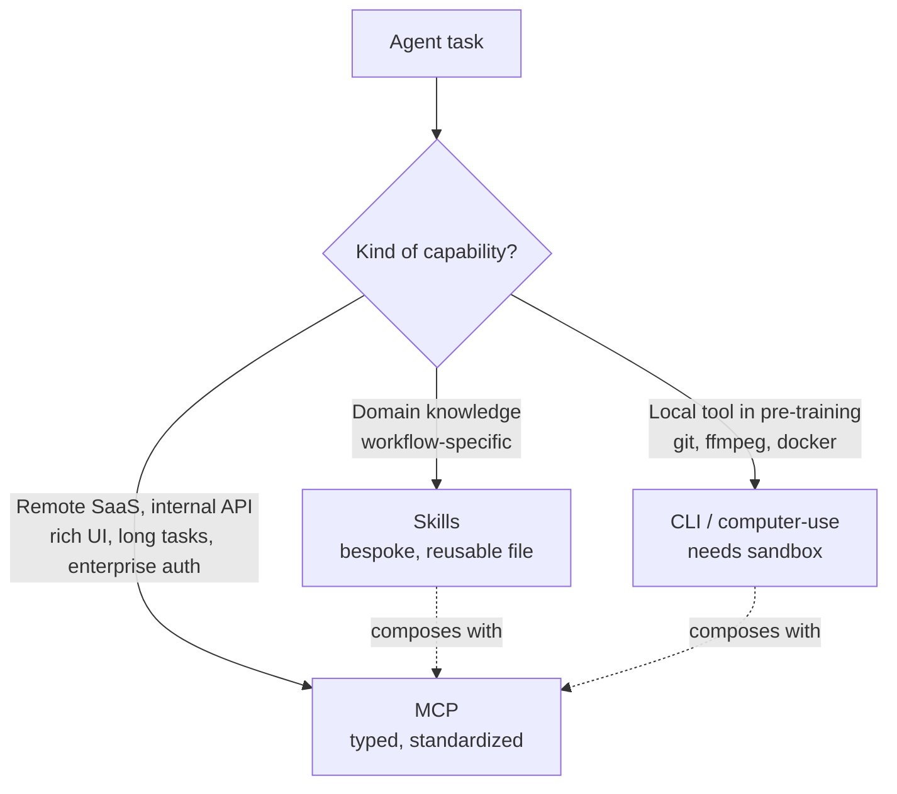

## Core Thesis

MCP is no longer the debate about whether the protocol deserves to exist — 110M monthly downloads, reached in half the time React needed, settles that. The debate worth having is **what the connectivity stack for 2026 looks like**, and Soria Parra's answer is: not one thing. The best agents will use **Skills, MCP, and CLI/computer-use together**, chosen by situation — the same "it depends" conclusion [[mcp-vs-cli-is-the-wrong-fight]] reached from a benchmark angle, now stated from inside Anthropic.

The talk opens with a tell: a chart rendered live from an **MCP Application** — an agent interface shipped by the server itself, not a plug-in, not an SDK, not model-generated HTML, portable across ChatGPT, Claude, VS Code, and Cursor. That single opener encodes the entire roadmap: MCP is growing out of "tool calls" into a full protocol for shipping UI, skills, and long-running tasks between agent and server.

## The 2024 → 2025 → 2026 Arc

- **2024** — demos and buzz; little shipped.
- **2025** — coding agents. The "ideal scenario": local, verifiable, a compiler nearby, a developer at the keyboard, a TUI that's enough.
- **2026** — general agents for knowledge workers (financial analysts, marketers). No compiler to call. The binding constraint flips from _verifiability_ to _connectivity_ — five SaaS apps and a shared drive.

This framing is why the CLI-vs-MCP debate keeps talking past itself. CLI wins the 2025 world (local, sandboxed, pre-trained knowledge of Git/ffmpeg/Docker). MCP starts earning its keep in the 2026 world (remote SaaS, no sandbox, auth matters, long-running tasks, UI must render).

## The Connectivity Stack

Three lanes, chosen by situation. Pasted onto the 2025-vs-2026 framing:

| Lane                   | Strongest when                                                               | 2025 default                  | 2026 addition                                       |
| ---------------------- | ---------------------------------------------------------------------------- | ----------------------------- | --------------------------------------------------- |
| **Skills**             | Workflow is bespoke to your team                                             | Agent instructions, CLAUDE.md | "Skills over MCP" lets servers ship skills too      |
| **CLI / computer-use** | Local tool, sandbox available, in pre-training                               | Core of coding agents         | Still the right answer for local                    |
| **MCP**                | Remote service, no training priors, auth/governance, long tasks, rendered UI | Tools-only, local             | Apps, tasks, elicitations, skills, cross-app access |

## What Harnesses Must Build

### Progressive discovery

Dumping every tool into context is the 2025 mistake. The fix is **tool search** — give the model a meta-tool that lets it pull tool definitions on demand. Claude Code already does this; the talk shows before/after context-usage plots with a dramatic reduction. The protocol already supports it; the gap is harnesses adopting the pattern. See [[progressive-disclosure]] for the underlying UX pattern this is borrowing.

### Programmatic tool calling (code mode)

Don't let the model orchestrate N tool calls through inference. Give it a **REPL tool** — a V8 isolate, a Lua interpreter, a sandbox — and let it write a script that calls tools, filters JSON, composes results, and returns. Every orchestration step done in code is a step not done in inference: cheaper, faster, more composable. MCP's **structured output** feature gives the model the type info it needs to chain calls reliably; when a server doesn't expose it, synthesize it with a cheap secondary model. This is the same argument [[code-mode-mcp]] and [[tanstack-ai-code-mode]] make from the tooling side, now endorsed as the default pattern.

The takeaway: **inference is precious, bash is cheap**. Claude Code already does this informally every time it writes a bash pipeline. Make it explicit for MCP too.

## What Server Authors Must Build

> "Every time I see someone building another REST-to-MCP server conversion tool, I'm — it's a bit cringe."

The core instruction: **design for the agent**, not for the REST spec. Three moves:

1. **Stop doing 1:1 REST→MCP translation.** The surface your API exposes to humans through docs and a client SDK is not the surface an agent wants.
2. **Put the execution environment on the server too.** Cloudflare's MCP server exposes a sandbox the agent drives with code, instead of dozens of narrow tools. Less token overhead, more composition.
3. **Use the rich semantics the protocol already offers** — MCP Applications, skills over MCP, tasks (long-running / async), elicitations (the server asking the user for a value mid-conversation). Most servers today ignore these primitives and ship tools-only.

## Protocol Roadmap — June 2026

Big release is landing in June. What's in it:

| Item                                           | What it does                                                                                                             | Who benefits                                |
| ---------------------------------------------- | ------------------------------------------------------------------------------------------------------------------------ | ------------------------------------------- |
| **Stateless HTTP transport** (Google-authored) | Replaces streamable HTTP. MCP servers deploy like stateless REST — Cloud Run, Kubernetes, standard load balancers        | Hyperscalers, any team running MCP at scale |
| **Async task primitive**                       | Proper agent-to-agent communication with long-running task semantics                                                     | Background work, multi-agent flows          |
| **TypeScript SDK v2 / Python SDK v2**          | Rewrites informed by FastMCP's design wins; explicit acknowledgment that the community SDK beat Anthropic's official one | Anyone building servers                     |
| **Cross-app access**                           | Standardized SSO — log in once to Google/Okta, use every MCP server without re-auth                                      | Enterprises                                 |
| **Server discovery**                           | Well-known URLs on any website let crawlers/agents ask "is there also an MCP server here?"                               | Ecosystem growth                            |
| **Skills over MCP** (extension)                | Servers ship domain knowledge alongside tools; updates without plug-in registries                                        | Large-catalog servers                       |
| **MCP Applications** (extension)               | Server-shipped UI, rendered in web-capable clients, CLI clients gracefully skip                                          | UX-heavy integrations                       |

**Extensions are intentional.** Not every client will implement every extension — a CLI can't render HTML, so MCP Apps skip it. That's the design, not a bug.

## Productive Tension

- **With [[mcp-vs-cli-is-the-wrong-fight]].** Smithery concluded from benchmarks that CLI wins local and MCP wins remote, and that the interface debate is downstream of API quality. Soria Parra reaches the same conclusion from inside Anthropic — and goes further: on the server side, "agent-first CLI" and "raw REST MCP" are both anti-patterns, because both ignore the semantics MCP gives you for free. The Smithery post was diplomatic; the keynote is explicit that REST-to-MCP is "cringe."
- **With [[code-mode-mcp]].** Cloudflare's argument was that `search()` + `execute()` beats 1.17M-token tool catalogs. Soria Parra promotes this to the default harness pattern and adds: structured output is the piece that makes code-mode reliable. The protocol already has it; most servers don't populate it.
- **With [[playwright-cli-vs-mcp]].** Not contradicted — endorsed. Playwright is a _local tool with filesystem access_, which is exactly where Soria Parra says CLI wins. The connectivity stack explicitly keeps a lane for it.
- **With [[why-model-context-protocol-does-not-work]].** Soria Parra concedes the context-bloat criticism was valid but argues the fix isn't "ditch the protocol" — it's "fix the harness." Progressive discovery is the direct response.

## Key Quotes

> "If someone tells you there's one solution to all your connectivity problem — be it computer use, be it MCP — they are probably pretty wrong."

> "We need to go and start building something called progressive discovery. Most people when they think about MCP, they think about context bloat. But the client is responsible for dealing with that information."

> "Every time I see someone building another REST-to-MCP server conversion tool, it's a bit cringe."

> "FastMCP is way better than the Python SDK we ship. And that's on me because I wrote the Python SDK."

## Why I Saved This

Three reasons.

First, this is the clearest single-source framing of the **2026 connectivity stack** from someone with authority to shape it. It aligns with the benchmark-driven answer from Smithery and the tooling-driven answer from Cloudflare — three independent sources converging on "use all of it, chosen situationally." Worth treating as the new default frame.

Second, the **protocol roadmap is concrete and dated** (June). Stateless transport, cross-app access, server discovery, skills-over-MCP — these change what's reasonable to build this year. Anyone shipping an MCP server in April should hold off on non-trivial transport or auth work until the June spec.

Third, the "stop doing 1:1 REST→MCP" line is the one I'll keep coming back to. It's the same shape as Ousterhout's _deep modules_ argument from [[deep-and-shallow-modules]]: the cost of an interface is its surface area, and pasting a 200-endpoint REST catalog through MCP gives you a maximally shallow module pretending to be useful. Design for the agent, then the MCP layer is just packaging — the same "APIs are products" point [[mcp-vs-cli-is-the-wrong-fight]] closes with.
