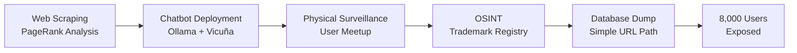

## Overview

Investigative journalists Eva Hoffmann and Christian Fuchs, along with hacker Martha Rud, expose White Date—a dating platform for white supremacists operating since 2017. Their investigation combined AI chatbots, traditional surveillance, and embarrassingly simple OSINT to identify the operator and map thousands of users, including German politicians.

## Key Arguments

### White Supremacy Has Gone Global

The far-right has transformed from isolated nationalist cells into an international movement united by "white genocide" conspiracy theory. White Date exemplifies this shift: users from dozens of countries connect to find partners who share their "Rassenverständnis" (racial understanding). Profile bios openly discuss "preserving bloodlines" and seeking partners with "pure German ancestry."

This international coordination extends beyond dating. German neo-Nazis travel to Ukraine for weapons training with Azov Regiment, while others fight for Russia's Imperial Movement. The platform's founder claimed only 6% of the world's population is white and "we must fight every day to prevent extinction."

### The Investigation Method

Martha scraped right-wing networks before the German federal election and discovered White Date through PageRank analysis. She created AI-powered chatbot profiles using Ollama and Vicuña to engage users and extract information. When one user invited "her" to meet the platform's operator Leide, Martha observed their meetup from a distance and traced them to a villa near Kiel.

The final breakthrough was anticlimactic: the registered trademark "White Date" was linked to Christiane H., a 57-year-old woman with no prior extremist record. The entire user database? Available at `whitedate.net/download-all-users`—no exploit required.

### Intelligence Failure

The German Verfassungsschutz (domestic intelligence) knew about White Date since 2019 but never identified its operator. Worse, they targeted an innocent woman—a romance novelist who happened to share the pseudonym "Leif Heide"—leading to her wrongful termination from a Berlin university. The actual operator remained unknown until journalists did the work.

## Visual Model

The investigation workflow that exposed White Date:

::

## Notable Quotes

> "Wir sind weise Menschen, wir sind die Herrenrasse und darum kämpfen wir für das gleiche Ziel."
> — Profile user explaining the shared ideology

> "Also wofür Martha wenige Tage gebraucht hat, hat der gesamte Verfassenschutzapparat in Deutschland in 6 Jahren nicht geschafft."
> — Christian Fuchs on intelligence failure

## Practical Takeaways

- Far-right movements increasingly coordinate internationally through shared narratives rather than organizational structures
- Basic OSINT (trademark registries, domain records) often yields more than sophisticated technical attacks
- AI chatbots can effectively engage targets for extended periods when prompts are carefully tuned
- Platform security failures are common—"start with the simple things" before attempting complex exploits
- Professional journalism can expose what state intelligence agencies miss

## User Demographics

The leaked database revealed approximately 3,600 US users and 600 German users. Notable discoveries included five local AfD politicians, three BSW members, Identitarian movement members, and one sitting member of the Hamburg state parliament. Gender imbalance was significant—far more men than women.

## Connections

This is a standalone note. No genuine connections to existing content in the knowledge base.
