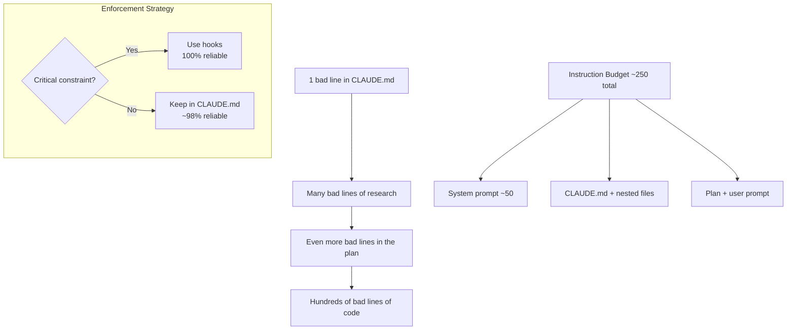

## The Leverage Cascade

The core framing: errors cascade multiplicatively through the stack. One bad line in your CLAUDE.md file produces bad research, which produces bad plans, which produces hundreds of bad lines of code. The reverse is also true — one well-placed instruction can save entire sessions from going sideways.

::

## The Instruction Budget

The insight that reframes everything: LLMs have a finite instruction-following capacity. Research shows accuracy drops after ~150-250 instructions depending on the model. Claude Code's system prompt already consumes ~50 of those. That leaves ~200 for your CLAUDE.md, your plan, your prompt, and anything else the model reads during a session.

This is why bloated CLAUDE.md files actively hurt performance. It's not just about token cost — you're spending your instruction budget on low-value instructions that crowd out the ones that matter.

## Trust the Model, Remove the Training Wheels

Vercel's D0 agent case study drives this home. They built a data analysis agent with heavy prompt engineering and many specialized tools — 80% success rate. Then they stripped it down to two tools and minimal instructions, trusting the model's built-in capabilities. Result: 100% success rate, fewer steps, less tokens.

The takeaway for CLAUDE.md: as models improve, many "best practices" you wrote get baked into the model itself. Instructions like "use encryption for passwords" or "don't use any-casts" become redundant — and worse, they may constrain the model from applying its own (potentially better) approach.

**The practice:** with every model release, audit your CLAUDE.md for what to _remove_, not what to add. If a new model handles something natively, your old instruction is now dead weight at best, a constraint at worst.

## Why Fresh Codebases Sometimes Work Better

This explains an observation many developers have had: a new model sometimes performs better on a project with no CLAUDE.md at all. Without legacy constraints written for older, weaker models, the new model can apply its full capabilities. Your CLAUDE.md might be holding it back.

## Nested Files as Lazy Loading

The mechanism behind progressive disclosure: when Claude Code reads any file, it automatically appends the CLAUDE.md from that file's directory to the tool result. Only the hierarchy relevant to that specific file path loads — not the whole tree.

This means your root CLAUDE.md can stay lightweight while domain-specific context lives in nested files. A Supabase migration workflow doesn't need to eat instruction budget when you're working on frontend components — it only loads when Claude touches a file in the `supabase/` directory.

## Hooks Beat Instructions for Enforcement

CLAUDE.md instructions get ignored roughly 1-in-50 times, especially in long sessions where the model gets confused. For critical constraints — "never run `db push`", "never modify this directory" — use pre-tool-use hooks instead. Hooks execute deterministically. They work every single time regardless of session quality.

The pattern: convert any CLAUDE.md instruction that starts with "never" into a hook. Keep the CLAUDE.md for guidance and preferences; use hooks for hard enforcement.

## Start From Zero

Don't use `/init`. Don't paste templates from Twitter. Start with the bare minimum:

1. A one-line project description
2. Key commands the model can't infer from the codebase

Then add instructions _only_ when you observe the model making a mistake. Commit each addition separately so you can git-blame which line caused a regression if performance degrades.

## Position and Auditing

LLMs weigh instructions near the beginning and end of their context more heavily than the middle. Structure accordingly: project description and key commands at the top, critical caveats near the bottom.

Ray analyzed 1000+ public CLAUDE.md files from GitHub. About 10% exceeded 500 lines — which likely explains why Anthropic added the "may or may not be relevant" caveat to the system prompt. Most CLAUDE.md files were distracting the model rather than helping it.

## Connections

- [[writing-a-good-claude-md]] — HumanLayer's guide covers the same "less is more" principle but from a structural angle. This video adds the instruction budget math and the "remove with each model release" practice
- [[context-engineering-guide]] — The leverage cascade fits into the broader context engineering picture: CLAUDE.md is one layer of the context stack, and each layer has a budget
- [[complete-guide-to-claude-md]] — Builder.io's guide covers file locations and setup mechanics; this video focuses on the maintenance philosophy and why most files actively hurt performance
