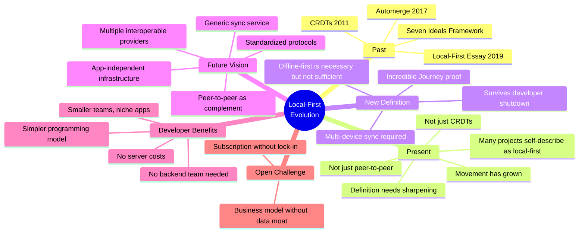

## Overview

Martin Kleppmann, co-author of the original [[local-first-software]] essay, reflects on five years of local-first development and proposes a sharper definition: local-first software must survive not just network outages, but the complete disappearance of its creators. The talk moves from personal history (discovering CRDTs in 2013, building Automerge, coining the term) to the real thesis: sync should become commoditized infrastructure, and local-first changes the economics of software development more than the technology.

::

## Key Arguments

### A Clearer Definition

The original seven ideals described benefits, not a definition. Kleppmann proposes something crisper: "In local-first software, the availability of another computer should never prevent the user from working." This includes three requirements:

1. **Multi-device** - Data syncs between devices (not just local-only desktop software)
2. **Offline-capable** - Works without network connectivity
3. **Incredible Journey proof** - Survives even if the developer shuts down all servers

### CRDTs Are Necessary But Not Sufficient

Skiff, an end-to-end encrypted Google Docs alternative built on yjs, still appeared on the "Our Incredible Journey" blog when Notion acquired and shut it down. Technology alone doesn't guarantee resilience—the entire application architecture must be built for independence.

### Self-Hosting Isn't the Answer

Self-hosting requires technical skills most users lack. Even those with skills often don't want to run servers. It's a partial solution at best.

### The Vision: Commoditized Sync Infrastructure

The future Kleppmann envisions: generic syncing services that any local-first app can use, speaking standardized open protocols. Multiple providers (AWS, Azure, independent operators) would interoperate. Users could switch providers by changing a single configuration flag.

This architecture treats sync like utilities—app developers focus on user experience while sync becomes commoditized infrastructure.

### Peer-to-Peer as Enhancement, Not Foundation

Peer-to-peer works brilliantly for devices on the same table but struggles with NAT, firewalls, and requiring simultaneous online presence. The pragmatic approach: use peer-to-peer opportunistically alongside cloud sync for redundancy.

### Radical Simplification for Developers

The economic implications run deep. Local-first eliminates entire categories of work:

- No backend engineering team needed
- No network error handling code
- No server operations or on-call rotations
- No cloud infrastructure bills

Small teams can build impressive apps for niche audiences. Prototypes that would take months emerge in weeks.

## Notable Quotes

> "A distributed system is one in which a failure of a computer you didn't even know existed can render your own computer unusable."
> — Leslie Lamport (1987)

> "We want to make sure that the users can always continue doing their work regardless of whether they have an internet connection and regardless of whether the servers of the software developer disappear."

## Practical Takeaways

- Don't rely solely on CRDTs—architect the entire application for independence
- Consider sync infrastructure as a separate, swappable concern
- Peer-to-peer complements but shouldn't replace cloud sync
- The simplified development model changes startup economics fundamentally
- The "data moat" weakens when users own their data—business models must adapt

## Connections

- [[local-first-software]] — The original essay Kleppmann co-authored, revisited here five years later with a sharper definition and the "Incredible Journey proof" framing
- [[what-is-local-first-web-development]] — Alexander's own practical take on implementing these principles in web apps with Vue and PWAs
- [[the-big-questions-of-local-first]] — Panel discussion from the same conference where Kleppmann debates these open questions with other local-first pioneers
- [[sync-panel-discussion]] — Another Local-First Conf panel focused on the sync architecture challenges Kleppmann's "commoditized sync" vision would solve
- [[ux-and-dx-with-sync-engines]] — Practical sync engine patterns that demonstrate the developer experience improvements Kleppmann argues for
