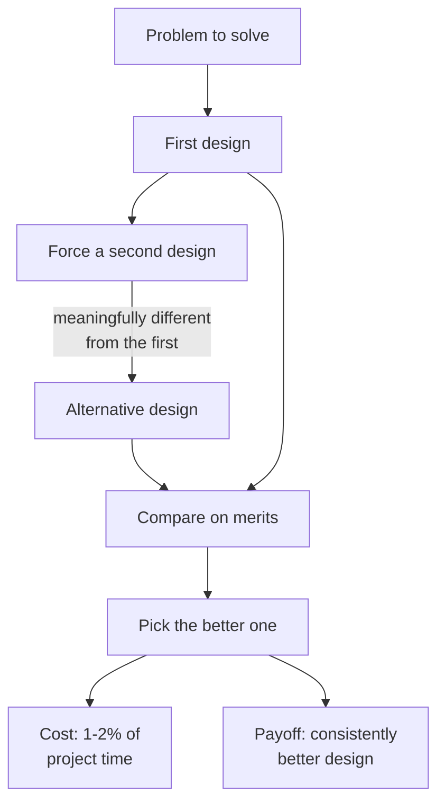

## The Core Claim

Autocomplete will get better. Low-level code is becoming commodity. What's left is design — decomposition, module depth, deciding what problem to solve — and Ousterhout is blunt that universities teach essentially none of it. Stanford's course is "probably the only one of its kind worldwide," and it lapses when he retires at the end of 2026. Nobody has picked it up.

That's the distinctive framing of this episode: the AI shift makes design skills more valuable precisely as we're training a generation without them.

## Key Arguments

### AI raises the stakes on design, not typing speed

Autocomplete will keep improving and likely produce reasonably high-quality low-level code. What Ousterhout sees nothing of in current tools is higher-level design — deciding _what_ to build and how to decompose it. The consequence: design becomes a larger fraction of developer time, which makes the absence of design education more consequential, not less. This is the same endpoint as Fowler's framing in [[how-ai-will-change-software-engineering]], reached from a different direction.

### Decomposition is the single most important idea in CS

When he asks audiences what they think is the most important idea in computer science, his own answer is decomposition — breaking large problems into pieces you can implement independently. Design _is_ decomposition; implementation is what happens to the pieces afterward. Everything else in his philosophy falls out of this.

### TDD works against design because its units are too small

"I'm not a fan of TDD because I think it works against design." The problem isn't testing — it's that red-green-refactor forces you to work in one-test-at-a-time increments with no step where you consider the whole. The result is "ten point solutions to individual problems" instead of one general-purpose abstraction. His rule: units of development should be abstractions, not individual tests. The only exception is bug fixes — and even then he admits to writing the fix first, backing it out, running the test to confirm red, then reapplying.

### Over-decomposition is the more common error today

The Clean Code reflex to make everything tiny produces entangled short methods — ones you can't understand without reading several others. The fix he tells students: look for closely related pieces and _combine_ them. You often get a deeper module by merging, not splitting. The criterion is depth (rich functionality behind a simple interface), not line count. This is the argument [[deep-and-shallow-modules]] makes at book length, but here he names combining-as-a-move explicitly.

### Every exception imposes complexity on every caller — but don't ignore real errors

Throwing exceptions isn't careful programming; it's externalising cost. Redesigning can often make whole categories of errors impossible (the "define errors out of existence" chapter). But he calls this chapter "like a spice" — students routinely misread it, ship distributed servers with no error checking, and claim they defined the errors away. They didn't; they just ignored them. The chapter is about _redesign_, not _omission_.

### Comments exist because signatures can't carry everything

Ousterhout rejects the Martin claim that comments mostly mislead via staleness. Interface comments carry things callers need that the signature can't. Class member variables need the invariant stated. Inside methods, he writes few unless something's genuinely tricky. His position is narrower than the book's caricature — not "comment everything" but "comment what the signature can't tell you."

### AI compensates for missing comments but doesn't replace them

Working in the Linux kernel, he uses ChatGPT as his "best friend" for navigating undercommented code. "Even when it's wrong, it typically gets me in the right vicinity." But the punchline is a warning: "We shouldn't use AI tools as an excuse for people not to write comments." LLMs also write inline comments on generated code, which he finds useful for verifying what the code actually does — necessary hedge against hallucination.

### Design it twice — even a forced-bad second design teaches you

Brilliant students latch onto first ideas because they've been rewarded for them their whole careers. Ousterhout forces a second alternative under threat: "suppose I told you that you may not implement this." The second idea is consistently better. Canonical example: the Tk widget API was his second design, sketched on a long flight, and became "one of the best ideas I've had in my professional career." Cost: 1–2% of total project time. Payoff: a better system.

### A whiteboard technique for breaking deadlocked decisions

When a design meeting stalls, list every for-and-against argument on the whiteboard. Rule: you can't repeat an argument that's already on the board. Discussion converges fast because the space of real arguments is smaller than the space of restated arguments. Then a straw poll resolves it. Small move, high yield.

## Points of Emphasis Beyond the Book

- **General-purpose over specialization** is given more weight in the second edition than the first. Many readers have the first and don't realise the update exists.
- The AI framing is new ground — the book doesn't address LLMs at all. This episode is the first public read of the book's ideas through a 2025 lens.
- His critique of Clean Code's short methods is more concrete here: not "shortness is bad" but "shortness as an absolute produces entangled methods where you can't understand one without reading the others."

## Notable Quotes

> "The skills we're teaching students may actually be the skills that are going to be replaced by the AI tools."

> "Decomposition. That's the key thing that threads through everything we do."

> "Nobody's first idea is going to be the best idea."

> "I'm not a fan of TDD because I think it works against design."

> "Every exception you throw is imposing complexity on the users of your class."

> "It's kind of like a spice. You use tiny amounts of it in your cooking and you get a good result, but if you use very much, you end up with a mess." — on defining errors out of existence

> "If the code could fully speak for itself, that would be wonderful. But it can't, and it never will."

> "We shouldn't use AI tools as an excuse for people not to write comments."

## Resources Mentioned

- _A Philosophy of Software Design_ 2nd edition — more emphasis on general-purpose design.
- The upcoming _Clean Code_ 2nd edition (Robert Martin) — contains the Ousterhout/Martin written debate as an appendix.
- Homa — Ousterhout's TCP replacement for data center applications, currently being upstreamed to the Linux kernel.

## Why I Care

The framing lands for me because it's the inverse of how the AI conversation usually runs. Most of what I read treats AI either as a productivity multiplier (faster typing) or an existential threat (replacement). Ousterhout reframes it as a _redistribution_: the low-level stuff gets cheap, the high-level stuff gets disproportionately valuable, and the high-level stuff is the thing we don't teach. That matches what I'm seeing day-to-day in Vue/TS work — the bottleneck isn't writing the component, it's deciding the right boundary for it. Every "should this be a composable or a component" debate is really a depth question.

Three things stick:

**The TDD critique is sharper here than in the book.** It isn't "tests bad." It's "the unit of work in TDD is a test, and that's too small to design against." In Vue land this maps cleanly to the componentize-every-line reflex — you end up with tiny shallow components whose relationships you can't hold in your head. Same disease, different ecosystem.

**Combine, don't split.** The move I don't reach for often enough. Most of my refactors are extractions. Ousterhout's framing — that depth sometimes comes from _merging_ two closely-related pieces behind one interface — is the one I want sitting next to me when I review a PR that splits a useful chunk into three shallow ones.

**The AI-as-comment-substitute is the interesting tension.** He's right that LLMs make undercommented code navigable in a way it never was before. But that _lowers the apparent cost_ of not writing comments, which means fewer people will write them, which means more future code is navigable only through an LLM. That's a one-way ratchet worth naming.

The solo conversation is a useful companion to [[ousterhout-martin-software-philosophies]] — where the debate format constrains him to reply to Martin's specific claims, this format lets him lay out the whole framework on his own terms, including the AI chapter the book doesn't have.

## Connections

- [[ousterhout-martin-software-philosophies]] — The debate version of the same positions. Read this solo interview first for the framework; read the debate next for where it gets challenged. The written-debate format forces concessions the solo format doesn't.
- [[deep-and-shallow-modules]] — The book-length argument for the depth criterion he defends here. The specific move this episode adds: _combining_ as a depth-increasing refactor, not just splitting-badly as the anti-pattern.
- [[how-ai-will-change-software-engineering]] — Fowler reaches the same "design matters more now" conclusion by a different path (non-determinism of LLM output). Reading the two together: Ousterhout worries about what gets automated away; Fowler worries about what new kind of system you're now managing. Both land on design literacy as the bottleneck.
- [[the-wet-codebase]] — Abramov's anti-DRY-as-dogma maps directly onto Ousterhout's anti-small-methods-as-dogma. The shared pattern: a rule ripped from its context, reflexively applied, producing entangled code. "Inline instead of extract" (Abramov) is the same move as "combine instead of split" (Ousterhout).
- [[senior-engineers-guide-to-ai-coding]] — Concrete version of what "design becomes more important" looks like in an AI-augmented workflow. Where Ousterhout names the shift abstractly, this note names the daily practices that change.
