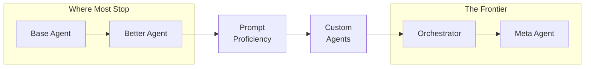

IndyDevDan's argument here is structural, not tribal: Claude Code is winning, but its success creates a gravitational pull toward the median user. Pi agent (by Mario Zechner) takes the opposite bet — ship almost nothing by default, let engineers build everything.

The interesting question isn't "which is better" — it's whether controlling the agent harness layer matters more than prompt engineering. Dan thinks it does, and the Pi extension system is his evidence.

## The Design Philosophy Split

Claude Code ships with ~10,000 tokens of system prompt, multiple safety modes, and 8+ default tools. Pi ships with ~200 tokens and 4 tools: `read`, `write`, `edit`, `bash`. That's it.

This isn't minimalism for its own sake. The thesis: every opinionated default is a ceiling. Claude Code's safety theater (Dan's words) slows down engineers who know what they're doing. Pi's YOLO mode — full device access, no confirmation prompts — is the default because the target user is someone who understands the consequences.

## Extensions: The Core Differentiator

Pi's killer feature is its extension system — composable TypeScript units that hook into the agent lifecycle. 25+ hook points covering tool calls, session events, input events, and agent completion.

The "Till Done" extension demo is the strongest proof of concept: ~700 lines of TypeScript that forces the agent to create tasks before executing any tool calls. It registers custom commands, custom tools, and hooks across `onInput`, `onAgentEnd`, `onToolCall`, and `onSession`. This is the kind of control Claude Code simply doesn't expose.

Other extensions shown: damage control (blocking dangerous bash commands via hooks), theme cycling, system prompt switching at runtime, and persistent UI widgets in the terminal.

## The Progression Path

::

Dan traces six stages of agentic engineering maturity. Most engineers are stuck at stage 1-2: using a base agent, maybe tweaking their CLAUDE.md. The leap to custom agents (stage 4) requires controlling the harness — the layer around the model. Pi exposes that layer; Claude Code abstracts it away.

The frontier is meta agents — agents that generate other agents. Pi supports this through agent teams (YAML-configured specialist groups) and agent chains (sequential pipelines where output feeds input). Neither is native to Pi; both are built through extensions. That's the point.

## Feature Comparison (What Matters)

| Feature       | Claude Code    | Pi Agent            |
| ------------- | -------------- | ------------------- |
| System prompt | ~10K tokens    | ~200 tokens         |
| Default tools | ~8             | 4                   |
| Safety model  | Multiple tiers | YOLO (full access)  |
| Hook points   | Limited        | 25+                 |
| Extensions    | Skills + hooks | Full TypeScript SDK |
| Sub-agents    | Native         | Via extensions      |
| MCP support   | Yes            | No                  |
| Multi-model   | Limited        | Any provider        |
| Agent teams   | Native (new)   | Via YAML config     |

## The Strategic Take

The recommendation: 80% Claude Code, 20% Pi. Claude Code for reliable, well-understood work. Pi for experimental agent workflows, multi-model setups, and anything where you need to control the harness itself.

The line that sticks: "You can't get ahead of the curve by doing what everyone else is doing." If everyone's using Claude Code with the same defaults, the differentiation comes from building your own agent layer — and Pi is the tool that enables that.

## Notable Quotes

> "Every single engineer is limited by the tools they use because the tools you use shape what you believe is possible."

> "Agentic engineering means knowing what your agent is doing so that you don't have to look. If you're vibe coding, it means you're not looking and you have no idea what your agent is doing."

> "There are no winners yet. There are only experimenters, thinkers, builders, and then everyone following them."

## Connections

- [[thread-based-engineering-how-to-ship-like-boris-cherny]] — Same author's framework for measuring agentic engineering maturity. Pi's agent teams and chains map directly to B-threads (nested) and C-threads (chained) from that model.
- [[claude-code-damage-control]] — Same author's damage control hooks for Claude Code. This video shows the Pi equivalent built as an extension — same concept, different harness.
- [[my-4-layer-agentic-browser-automation-stack]] — Same author's layered thinking about agent tooling. Pi's extension system enables the exact stack he describes: skills → agents → orchestration → reusability.
- [[im-boris-and-i-created-claude-code]] — Boris Cherny's insider tips for Claude Code. Interesting to read alongside this as the "embrace the platform" counterargument to Dan's "own the harness" philosophy.
