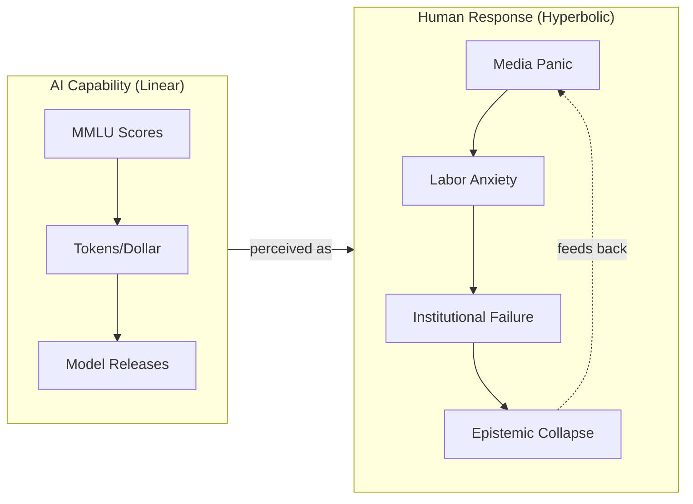

## Summary

Cam Pedersen fits hyperbolic curves to five AI progress metrics—MMLU scores, tokens per dollar, frontier release intervals, arXiv "emergent" papers, and Copilot code share—to calculate when the singularity arrives. The twist: only one metric displays genuine hyperbolic behavior, and it's not a capability metric. The arXiv paper count around "emergent" behaviors is the lone accelerating curve. Everything else moves linearly.

The conclusion flips the singularity narrative. Machines improve at a constant rate. Humans are panicking about it at an accelerating rate that feeds its own acceleration. The singularity isn't a technical threshold—it's a social one, and it's already underway.

## Key Points

- **Five metrics tested**: MMLU scores, tokens per dollar, frontier model release intervals, arXiv "emergent" papers, and Copilot code share. Each normalized independently and fitted for hyperbolic curvature.
- **Only one is hyperbolic**: The arXiv paper count. Traditional capability benchmarks follow linear trajectories—steady improvement, not exponential takeoff.
- **Social singularity, not technical**: Labor displacement driven by AI's perceived potential rather than current performance. Regulatory frameworks lag behind. Capital concentrates in AI-adjacent stocks. Therapists report surging "Fear of Becoming Obsolete."
- **Epistemic collapse**: Research reproducibility declining, expertise lagging behind the pace of releases. The ability to evaluate what AI actually does degrades faster than AI itself improves.
- **Honest caveats**: Single-metric dependency, stationarity assumptions, benchmark saturation, and sparse data. Pedersen frames the analysis as measuring field excitement, not predictive capability.

## Visual Model

The core finding: machine capability advances linearly while human institutional response accelerates hyperbolically.

::

## Connections

- [[ex-google-officer-speaks-out-on-the-dangers-of-ai-mo-gawdat]] - Gawdat predicts a technical singularity by 2037 based on capability thresholds, while Pedersen argues the singularity is social and already happening—not when machines get smarter, but when humans can't cope with the rate of change
- [[the-bitter-lesson]] - Sutton's core claim that AI progress comes from scale supports Pedersen's finding: capability metrics advance linearly through steady compute gains, not through sudden breakthroughs that justify panic
- [[age-of-abundance]] - Explores the optimistic endpoint where AI creates prosperity, but Pedersen's social singularity describes the psychological and institutional strain that happens during the transition—even if abundance is the destination, the journey breaks people
