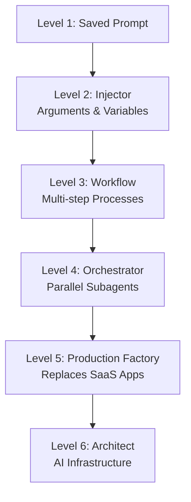

Most users treat slash commands as saved prompts. This video argues they're a programmable platform capable of replacing SaaS applications when used at higher levels of sophistication.

## The Six Levels

**Level 1: Saved Prompt** — Store a prompt for later use. Type the command, it injects into context, model responds. Example: `/explain` to explain code.

**Level 2: Injector** — Pass variables into the prompt: bash output, file contents, user arguments. The model receives enriched context tailored to your system.

**Level 3: Workflow** — Multi-step processes with conditional logic. "Do this, then this, stop if something breaks." Example: `/log-error` scans the conversation for what went wrong, asks clarifying questions, logs the error to a template with an auto-incremented ID.

**Level 4: Orchestrator** — Claude spawns subagents that work in parallel. Agent A and B build; Agent C validates. If tests fail, loop back. Example: frontend and backend built in parallel, then merged and tested together.

**Level 5: Production Factory** — Replace localhost SaaS apps with slash commands that understand your file system. Example: a `/refactor-video` command that transcribes long-form content, selects clips, builds animations in parallel, quality-checks with Playwright, syncs audio, and renders.

**Level 6: Architect** — Claude plans and executes using multiple subagents with domain skills. Each agent gets specialized knowledge via Claude skills. You become the reviewer, not the driver.

## Visual Model

::

## Key Insight

> "Claude Code is specifically designed to be able to tool call subagents. It's in its training. It was trained in the Claude Code sandbox to be able to do this and rewarded for doing this."

This explains why orchestration patterns work well—the model was optimized for spawning and managing subagents.

## Notable Quotes

> "By level six, you have Claude as a service, the equivalent power of software that costs hundreds per month, except it knows your files, your system, and bends to your workflow."

> "I want you to start thinking of slash commands in Claude Code as a method of replacing normal applications that are specifically tailored to you and your workflow."

## Connections

- [[understanding-claude-code-full-stack-mcp-skills-subagents-hooks]] - Covers the same extensibility layers (subagents, skills, hooks) from a different angle
- [[claude-code-skills]] - Level 6 relies on skills giving subagents domain knowledge; this note explains how skills work
