## Timestamps

| Time    | Topic                                                                   |
| ------- | ----------------------------------------------------------------------- |
| 00:00   | Introduction — Grady Booch's credentials and episode overview           |
| 01:28   | Origin of "software engineering" (Margaret Hamilton, NATO conference)   |
| 05:19   | The First Golden Age: algorithmic abstraction (late 1940s–late 1970s)   |
| 11:35   | Innovation on the fringes: defense, SAGE, distributed real-time systems |
| 17:48   | The software crisis and the problem of Babel (14,000 languages)         |
| 23:03   | Rise of object-oriented thinking (Simula, Stroustrup, Parnas)           |
| 31:06   | The Second Golden Age: object abstraction (1980s–2000s)                 |
| 35:28   | Open source roots and the economics of free software                    |
| 44:34   | Parallel history of AI: golden ages and winters                         |
| 46:59   | The Third Golden Age: platform-level abstraction (2000–present)         |
| 51:17   | Existential dread among developers over AI-generated code               |
| 57:34   | Dario Amodei's prediction that SE will be automated in 12 months        |
| 59:30   | Booch's rebuttal: "It's utter BS — he's profoundly wrong"               |
| 1:03:20 | English as a programming language and the limits of prompting           |
| 1:09:36 | Recommended foundations: systems theory, Santa Fe Institute             |
| 1:14:28 | Closing: "This is the time to soar"                                     |

## Key Arguments

### Software engineering is far more than coding (01:28)

Booch argues that software engineering balances technical, economic, ethical, and human forces — much like structural or electrical engineering. AI coding assistants automate code generation (the lowest abstraction level), but architecture trade-offs, ethical considerations, and system-level complexity remain squarely human problems.

### Every abstraction shift triggered the same crisis, then expanded the industry (05:19)

When compilers replaced hand-written machine code, assembly programmers feared obsolescence. When higher-order languages replaced assembly, the same fear recurred. Each time, the shift freed developers to work at higher levels, expanded the industry, and created new roles. The current AI shift is structurally identical.

### AI tools automate known patterns, not novel systems engineering (1:03:20)

Tools like Cursor and Copilot have been trained on problems solved "hundreds and hundreds of times before" — web-centric CRUD apps, common UI patterns, standard library usage. Defense systems, embedded systems, and distributed real-time architectures remain largely untouched by this automation wave.

### The Third Golden Age started around 2000, not with the recent AI boom (46:59)

The shift to platform-level abstractions (APIs, cloud services, package ecosystems) was already the defining characteristic of the third age. AI coding assistants are a reaction to — and acceleration of — this existing trend, not its origin.

### Democratization of software creation is a net positive (51:17)

Non-professionals building software with AI tools mirrors hobbyists building on personal computers in the 1980s. This expands the industry and enables automation of tasks that were previously economically impractical.

## The Three Golden Ages

```mermaid
graph LR
    subgraph First["First Golden Age (1940s–1970s)"]
        A1[Algorithmic Abstraction]
        A2[Business & Math Software]
        A3[Defense Innovation on Fringes]
    end
    subgraph Second["Second Golden Age (1980s–2000s)"]
        B1[Object Abstraction]
        B2[OOP, UML, Design Patterns]
        B3[Personal Computing & Open Source]
    end
    subgraph Third["Third Golden Age (2000–Present)"]
        C1[Platform Abstraction]
        C2[APIs, Cloud, Ecosystems]
        C3[AI-Assisted Development]
    end
    First -->|Software Crisis| Second
    Second -->|Scale & Complexity| Third
```

::

Each golden age introduced a new dominant abstraction. The fringe innovation of one age became the center of gravity of the next: defense systems pioneered distribution and real-time processing, which became mainstream in the second age. Platform-level thinking pioneered in the second age became the foundation of the third.

## Predictions Made

- **Software engineering will NOT be automated in 12 months** — Amodei conflates coding with engineering. The decision problems (balancing technical, economic, and ethical forces) are nowhere near automatable.
- **Developers who focus on systems-level skills will thrive** — The abstraction shift moves work from programs to systems, making human skills of managing complexity more valuable.
- **Non-professional software creation will expand massively** — Parallels the PC hobbyist era.
- **Simple app development skills will lose economic value** — Building standard iOS or web apps via prompting becomes commodity work. Professionals need to "move up a level of abstraction."

## Notable Quotes

> "The entire history of software engineering is one of rising levels of abstraction."
> — Grady Booch

> "Fear not, O developers. Your tools are changing, but your problems are not."
> — Grady Booch

> "There are more things in computing, Dario, than are dreamt of in your philosophy."
> — Grady Booch (paraphrasing Shakespeare)

> "I'll use a scientific term... It's utter BS. I think he's profoundly wrong."
> — Grady Booch, on Amodei's prediction that software engineering will be fully automated

> "You can either look and say 'Crap, I'm gonna fall into it.' Or you can say 'No, I'm going to leap and I'm going to soar.' This is the time to soar."
> — Grady Booch

## Connections

- [[ai-engineering-with-chip-huyen]] - Another Pragmatic Engineer episode exploring AI's impact on engineering, with Chip Huyen mapping the practical path from prompts to RAG to fine-tuning — the kind of systems-level work Booch says matters more than raw coding
- [[some-software-devs-are-ngmi]] - Geoffrey Huntley argues developers who refuse AI tools face attrition, which aligns with Booch's historical pattern: each abstraction shift rewards those who adapt and leaves behind those who cling to the previous level
- [[andrej-karpathy-were-summoning-ghosts-not-building-animals]] - Karpathy's argument that practical AI agents will take a decade echoes Booch's skepticism of Amodei's 12-month timeline for automating software engineering
