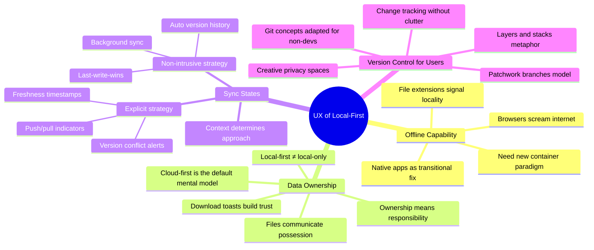

## Overview

Eileen Wagner — UX researcher at Superbloom, founder of the Decent Patterns library, and builder of local-first prototypes like Upwelling (collaborative editor at Ink & Switch) and Full Screen (collaborative whiteboard on Y.JS) — comes to Local-First Conf with a clear message: stop celebrating the promises and start fixing the UX gaps that will kill adoption before it starts.

Her framing is sharp. The tech community has spent years on the _why_ of local-first. Now we need the _how_ — specifically, four UX challenges that require collective solutions because inconsistent patterns across apps will confuse users out of the ecosystem entirely.

## Key Arguments

### 1. You Can't Demo Offline in a Browser

Nothing screams "internet" louder than a browser window. Wagner's team learned this building Full Screen — wrapping the app in Tauri for native downloads was the transitional fix, but it introduced new problems (managed devices that block app installs). The ideal? A new container paradigm that signals "this is a safe offline space" without the baggage of browser chrome.

File extensions turned out to be surprisingly powerful. A custom `.fullscreen` extension created instant mental associations: this file belongs to this app, it lives on _my_ machine. Downloads and toast notifications ("keep your work — save an editable copy") tested extremely well for communicating ownership.

### 2. Ownership Is a Responsibility, Not Just a Feature

The cloud-first ecosystem actively fights local-first UX. Default save directories point to cloud storage. Google Docs requires manual opt-in for offline. Podcast apps treat downloads as exceptions. Every platform convention tells users: local is the afterthought.

Wagner pushes harder than most on the uncomfortable side of ownership. In a user study on Shamir secret sharing for account recovery, participants happily designated peers to hold their shards — but refused when asked to hold someone else's. The actual quote: "Nah, I don't want that on my phone." More control means more responsibility for backups, security, and long-term preservation. The standard privacy pitch glosses over this tradeoff.

Her practical advice: local-first does not imply local-only. Cloud backups are smart. A big peer is smart. End-to-end encryption is table stakes.

### 3. Sync States Are a UX Nightmare

Dropbox has six sync icons and nobody knows what they mean. Local-first makes it worse by adding offline editing, version divergence, and the question of which version is the "agreed upon" one — not just the latest by timestamp.

Wagner identifies two strategies with no middle ground:

**Explicit** — push/pull indicators, freshness timestamps, conflict alerts interrupting your workflow to force review. Appropriate for financial reporting, legal documents, anything where wrong versions have consequences.

**Non-intrusive** — background sync, last-write-wins, automatic version history. Appropriate for collaborative whiteboards, casual tools, anything where approximate convergence is fine.

The trap: mixing strategies. Pick one. Context determines the right choice, but the icons themselves are already in conflict — a filled dot means "online peer" in Slack but "unsynced changes" in Figma. The community needs to agree on these conventions now, before they calcify.

### 4. Version Control Needs a Non-Git Vocabulary

CRDTs don't eliminate the need for manual intervention in serious collaboration. AI won't save you either — it just pushes review up one level (now you're reviewing the AI's merge decisions). Change management for local-first means answering: how do you track changes without visual clutter? How do you group them meaningfully? How do you propose, accept, reject, and amend?

Wagner's Upwelling prototype used a "stack and layers" metaphor — the document is a version stack, and you draft on layers that merge down. Patchwork (from Ink & Switch) uses visual branches instead. Both explore the same question: what does Git feel like when the user has never heard of Git?

This is where Wagner gets genuinely excited. It's rare for UX designers to get greenfield conceptual work — most of the time you're polishing existing patterns. Version control for non-developers is wide open.

::

### Bonus: "Local-First" Is Developer Speak

Wagner calls it out directly — "local-first" is not a user-facing term. Neither is "offline-first" or "cloud-optional." Her suggestion: "offline available" for capability description, "user-owned" for value signaling. Stop naming what you're _not_ building (cloud) and start naming what you _are_.

## Notable Quotes

> "There's nothing that screams more internet than a web browser."
> — Eileen Wagner

> "With a lot more control, you have a lot more responsibility."
> — Eileen Wagner

> "You want to do either one or the other and nothing in between."
> — Eileen Wagner, on explicit vs. non-intrusive sync UX strategies

## Practical Takeaways

- Use file extensions and download mechanics to communicate local ownership — they tested better than any UI indicator
- Cloud backup isn't a compromise of local-first principles, it's basic user safety
- Choose explicit or non-intrusive sync UX, never hybrid — the context of your app determines which
- Agree on shared icon conventions (filled dot = synced? online? unread?) before patterns diverge across apps
- Frame user-facing messaging as "offline available" or "user-owned," not "local-first"

## Connections

- [[local-first-software-pragmatism-vs-idealism]] — Same conference, same community tension. Wiggins frames the idealist/pragmatist divide; Wagner frames the developer/user divide. Both argue the movement needs to solve non-technical problems to succeed
- [[malleable-software]] — Wagner worked on Upwelling at Ink & Switch, the same lab behind Patchwork and the malleable software research agenda. Her version control UX explorations are direct implementations of that vision
- [[the-big-questions-of-local-first]] — The panel discussion grapples with the same sync strategy tensions Wagner identifies. Aaron's concentric circles model maps to her explicit vs. non-intrusive spectrum
- [[why-local-first-apps-havent-become-popular]] — Wagner's talk is essentially the UX answer to why adoption lags. Bambini focuses on the sync infrastructure challenge; Wagner shows the user-facing side of the same problem
- [[ux-and-dx-with-sync-engines]] — Assmann covers the developer experience of sync engines; Wagner covers what users actually see and struggle with on the other side of those abstractions
