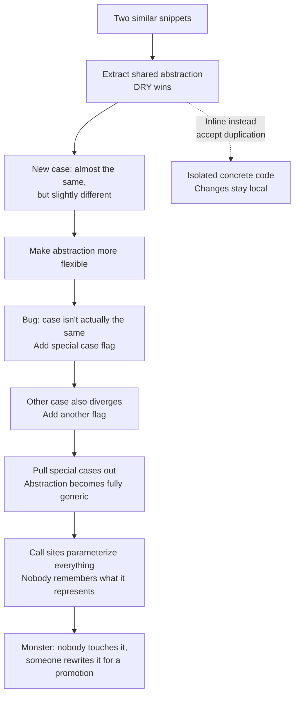

## Overview

Abramov's first non-React talk. He walks through the life of one "helpful" abstraction — extracted for DRY, generalised for a second case, patched with flags for a third — and shows how each local-sensible step compounds into a module nobody can touch. The fix isn't cleverer abstractions. It's the reflex to **inline first, abstract later**, and a team culture that treats deletion as legitimate work.

## The Decay of a Good Abstraction

Each step in the top chain reads like a reasonable PR in isolation. The damage only shows up when you stand back and realise the generic abstraction no longer represents anything — it's the union of every case that ever drifted through it.

## Key Arguments

### DRY flattens trade-offs into dogma

DRY was born as a reaction to real maintenance pain. It got passed down as a rule, stripped of the context that produced it. The next generation applies it mechanically and discovers new pain — wrong abstraction pain — which gets flattened into the next rule. Abramov's counter-move: when you teach a principle, teach what it's trading _away_.

### Accidental coupling is the hidden cost of abstraction

The textbook benefits of abstraction — intent, reuse, shared bug fixes — are real. But so are the costs. Two call sites sharing an abstraction are coupled even when their problems are unrelated. Fixing a bug in one can silently break the other. And the "focus on one layer" promise dissolves the moment a bug cuts across layers: "we try so hard to avoid spaghetti code that we create lasagna code."

### Inertia makes bad abstractions immortal

The social cost is worse than the technical one. New teammates don't feel allowed to suggest "just copy-paste this" — it sounds like worst practice. By the time the team agrees the abstraction is bad, the original callers have reorged, tests are tied to the abstraction rather than the feature, and inlining is no longer feasible. "Easy-to-replace systems tend to get replaced with hard-to-replace systems."

### Inline is a legitimate move

When a third case needs "almost the same" code, the senior move isn't to make the abstraction fancier — it's to inline it back. Duplication isolates change. Wrong abstraction propagates it. Both are imperfect; the bet is that isolated duplication stays fixable and centralised abstraction rots.

### Test the feature, not the abstraction

Where you put tests shapes what you can refactor. Tests on the abstraction lock the abstraction in — delete it and coverage drops, so nobody does. Tests on the concrete feature survive any restructuring underneath. They also act as a refactoring guide: pass, and the inlining was correct.

### Technology can make inlining easy or impossible

React's one-way data flow and tree-shaped component graph make inlining a copy-paste operation. Mutable shared state and cyclic dependencies make it effectively impossible. If your stack makes mistakes easy to undo, you can afford to experiment with abstractions. If it doesn't, abstract conservatively.

## Notable Quotes

> "We try so hard to avoid spaghetti code that we create this lasagna code where there are so many layers you don't know what's going on anymore."
> — Dan Abramov

> "Duplication isn't perfect in the long term, but wrong abstraction is also not perfect in the long term. So we need to balance these two problems."
> — Dan Abramov

> "Easy-to-replace systems tend to get replaced with hard-to-replace systems."
> — Dan Abramov (quoting a tweet he liked)

> "You might have a high school crush and they're really into the same obscure bands on Last.fm that you're into — that doesn't mean you have a lot in common and they're going to be a good life partner. Maybe you shouldn't do the same to the code."
> — Dan Abramov

## Practical Takeaways

- When the third "almost the same" case shows up, inline instead of generalising — similarity isn't the same as shared behaviour.
- Write tests against concrete features, not against abstractions. Tests on abstractions make refactoring look like coverage regression.
- Treat abstraction deletion as normal engineering work. "Let's spend some time to copy-paste this" should be a legal PR comment.
- When teaching a principle, teach the context and trade-offs — not just the rule. Principles without expiration dates become cargo cult.
- Choose stacks where undoing a bad abstraction is a mechanical operation, not a dependency-graph excavation.

## Why I Care

This is the clearest articulation of why AI-assisted codebases drift so fast. LLMs are DRY maximalists by default — they pattern-match similar blocks and pull them into helpers without feeling the "these aren't actually the same" friction a human gets when writing by hand. The result is exactly the lasagna Abramov describes: a helper that grew flags, parameters, and call-site contortions one well-intentioned PR at a time. The useful reflex to cultivate — and to prompt for — is **inline first, abstract once the real seams reveal themselves**.

It also reframes what "good code review" looks like in the AI era. Asking "is this abstraction earning its interface?" is more load-bearing than asking "is this DRY?". Code review becomes the checkpoint where accidental coupling gets caught before it becomes immortal.

## Connections

- [[deep-and-shallow-modules]] — Direct reinforcement. Zdražil/Ousterhout give the criterion (cost = interface, benefit = hidden functionality); Abramov gives the decay narrative of what happens when a shallow abstraction gets stretched to cover divergent cases. Same argument, different framing.
- [[tidy-first]] — Beck's "inline" is one of the tidyings Abramov is effectively promoting. Both treat duplication and abstraction as moves that should be reversible, not ratchets.
- [[6-levels-of-reusability]] — Thiessen's "each level trades simplicity for flexibility" is the same cost curve Abramov walks through, applied to Vue components. Watch for the moment a reusable component accumulates props the way Abramov's abstraction accumulates flags.
- [[avoid-nesting-when-youre-testing]] — Same anti-DRY reflex, applied to tests. Kent C. Dodds' argument that shared test setup makes tests harder to change is Abramov's point in a different domain: shared abstractions couple unrelated cases.
