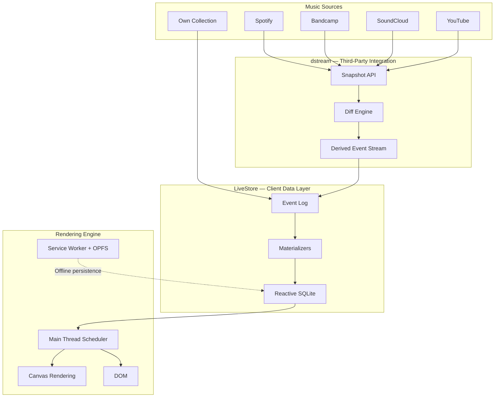

## Overview

Johannes Schickling opens the world's first dedicated local-first conference with a personal mission: music has lost its home. iTunes used to be that home — a place to curate, own, and care about a collection. Streaming fragmented that into a dozen tabs, devalued artists, and turned listeners into passive consumers. Overtone is his answer: a third-party client that unifies music sources, supports artists directly, and refuses to show a single spinner.

The technical story is just as opinionated. Building a web app that feels native means fighting the browser's defaults at every layer — main thread scheduling, canvas rendering instead of DOM, decoupled offline-first architecture, and an event-sourced SQLite data layer that sidesteps schema migrations entirely.

## Key Arguments

### Music Lost Its Home

The shift from owned music collections (Winamp, iTunes, vinyl shelves) to scattered streaming services left no single place where music lives. Spotify, SoundCloud, Bandcamp, YouTube — each holds a fragment. Worse, the streaming model devalues artists and turns fans into passive consumers. Overtone aims to be the "third-party email client but for music" — integrating all sources while enabling direct artist support through Bandcamp and Patreon.

### Web Apps on Hard Mode

Schickling builds Overtone as a web app first (Figma proved the model), but that means solving problems native apps get for free. Three key performance techniques:

1. **Main thread scheduler** — a custom frame-budget scheduler that yields to the renderer, maintaining 60-120 FPS even under heavy data loads
2. **Canvas over DOM** — tables and lists render to canvas instead of DOM nodes, bypassing virtual rendering limitations entirely
3. **Decoupled async** — network requests are optional asynchronous background tasks, not blocking operations. Images download on workers, resize locally, and render from cache

### LiveStore: Reactive SQLite with Event Sourcing

The research project formerly called Riffle continues as [[livestore]]. The core insight: unify state management and data management into one reactive SQLite layer. Queries return synchronously (no loading states), mutations flow through an immutable event log, and materializers translate events into SQL writes. The API feels like React state management but with the full power of SQL underneath.

::

### dstream: Event Sourcing for Data You Don't Control

The most novel pattern in the talk. Traditional apps fetch snapshots from third-party APIs (Spotify playlists, etc.) and dump them into state. Every refresh replaces everything, causing flicker and unnecessary re-renders. dstream sits between external APIs and the local database, diffing successive snapshots and deriving an event stream. The local database receives granular "track added", "artist updated" events instead of full replacements. When offline, nothing triggers — the app just works with whatever it had last.

### The Web App Engine Mindset

Schickling frames what he's building not just as a music app but as a web app engine — analogous to a game engine. The stack: TypeScript + Vite for productivity, Rust + WASM for performance-critical paths, React for UI with increasing canvas fallbacks, OPFS for persistence, and a custom web worker cluster that scales up and down. Custom dev tools (live performance meters, task counters) make the invisible visible.

## Notable Quotes

> "Next frame or money back."
> — TBH (nerd-sniping Johannes into his performance obsession)

> "I'm not just building a web app, I'm kind of building a web app engine."
> — Johannes Schickling

## Practical Takeaways

- Event sourcing sidesteps schema migrations — events are immutable, materializers rebuild state from scratch when schemas change
- For debugging distributed state issues, ask users for their event log and replay locally to reproduce the exact same state
- OPFS is mature enough for production persistence in browsers, though cross-browser bugs persist
- dstream's snapshot-to-event-stream pattern applies to any app integrating with APIs you don't control
- Custom main thread schedulers are necessary when frame budgets matter — standard React rendering can't guarantee 60 FPS under heavy data

## Connections

- [[livestore]] — This talk is the origin story for LiveStore (then called Riffle), explaining the motivation and architecture that the LiveStore docs formalize
- [[native-grade-web-apps-with-local-first-data]] — Schickling's ViteConf talk covers similar ground from a more technical angle, focusing specifically on the sync engine as declarative data revolution
- [[local-first-software]] — The foundational Ink & Switch essay that defines the ideals Schickling builds toward, particularly "no spinners" and data ownership
- [[local-first-the-secret-master-plan]] — Peter van Hardenberg's keynote at the same conference, showing how local-first enables the broader vision of malleable software
- [[superhuman-is-built-for-speed]] — Shares the "sub-100ms or it doesn't count" performance philosophy that drives Overtone's main thread scheduler approach
