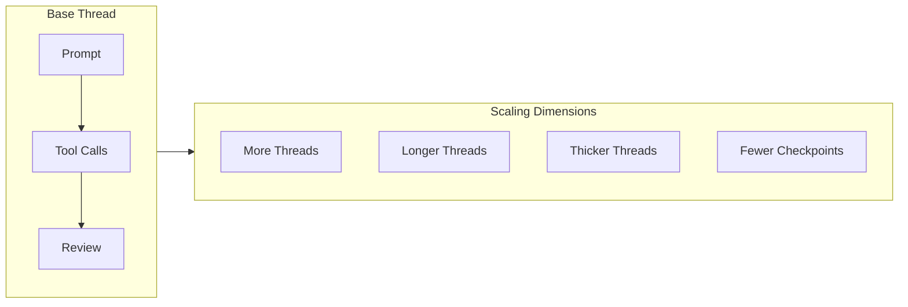

## Key Takeaways

How do you know you're improving as an agentic engineer? IndyDevDan proposes **thread-based engineering**—a framework for thinking about your work with AI agents as discrete "threads" of work where you show up at the prompt and the review.

### The Base Thread

A thread is a unit of engineering work over time driven by you and your agents. Every thread has two mandatory nodes:

1. **You prompt or plan** at the beginning
2. **Your agent works** through tool calls
3. **You review or validate** at the end

Tool calls roughly equal impact. Pre-2023, engineers were the tool calls. Now agents handle the middle while you show up at the beginning and end.

### The Six Thread Types

| Thread   | Name          | Description                                                                        |
| -------- | ------------- | ---------------------------------------------------------------------------------- |
| **Base** | Single thread | One prompt → agent work → one review                                               |
| **P**    | Parallel      | Multiple threads running simultaneously (Boris runs 5-10 Claude Codes in parallel) |
| **C**    | Chained       | Multi-phase work with intentional checkpoints for high-risk production work        |
| **F**    | Fusion        | Same prompt to multiple agents, then aggregate the best results                    |
| **B**    | Big/Nested    | Meta-threads where agents prompt other agents (sub-agents, orchestrators)          |
| **L**    | Long          | High-autonomy, extended duration work—hundreds of tool calls over hours            |

There's also a hidden seventh: the **Z-thread** (zero touch)—maximum trust where you skip the review step entirely.

## The Framework

::

## Four Ways to Improve

1. **Run more threads** — Spin up multiple terminals, work trees, or cloud instances
2. **Run longer threads** — Better prompting and context engineering enable higher autonomy
3. **Run thicker threads** — Nest threads inside threads (sub-agents, orchestrators)
4. **Reduce checkpoints** — Build systems you trust so you can skip human-in-the-loop reviews

### Boris Cherny's Setup (Referenced)

- 5 Claude Codes in terminal (tabs 1-5)
- 5-10 additional Claude Codes in the web interface for background work
- Uses stop hooks for very long-running tasks
- System notifications when Claude needs input
- Always uses Opus 4.5

## Notable Quotes

> "Tool calls roughly equal impact assuming you're prompting something useful. Pre-2023, you and I were the tool calls."

> "The engineer kicking off five agents in five separate terminals is getting more done than the one running a single agent."

> "If you don't measure it, you will not be able to improve it."

## Connections

- [[ralph-wiggum-technique-guide]] — The Ralph Wiggum pattern mentioned throughout is a specific implementation of thread-based engineering (loop over agent for deterministic work)
- [[boris-cherny-on-what-grew-his-career-and-building-at-anthropic]] — Boris's actual interview where he discusses his Claude Code philosophy and the generalist engineering approach
- [[building-effective-agents]] — Anthropic's guide covers similar patterns: parallelization maps to P-threads, orchestrator-workers maps to B-threads
