## Timestamps

| Time  | Topic                                      |
| ----- | ------------------------------------------ |
| 00:00 | Introduction and New Year health advice    |
| 05:00 | Why calorie-centric weight loss fails      |
| 12:00 | Insulin as the master metabolic hormone    |
| 18:00 | The type 1 diabetes weight gain phenomenon |
| 25:00 | Ketones and the ketogenic diet explained   |
| 35:00 | Ketones for brain and heart health         |
| 45:00 | Exogenous ketones and how to measure them  |
| 55:00 | Sex differences in ketogenic diets         |

## Key Arguments

### Insulin Controls Fat Storage, Not Calories (05:00)

Bikman argues that two isocaloric meals produce vastly different metabolic outcomes depending on their insulin response. A high-carb meal spikes insulin, which forces calories into fat storage and lowers the total energy available in the blood. The brain, which lacks storage capacity, then triggers hunger despite the body having abundant stored fat. This explains why calorie-restricted diets fail: they put you against your own hunger, and hunger always wins.

### The "One Hormone to Rule Them All" Principle (12:00)

Insulin tells every cell in the body what to do with energy. When insulin is high, the body stores. When insulin is low, the body burns. Bikman points to a stark demonstration: remove insulin entirely (as in untreated type 1 diabetes) and it becomes physically impossible to gain fat, regardless of calorie intake. Conversely, when type 1 diabetics begin insulin therapy, they can gain 10-15 pounds in just days while eating less than before.

### Ketones Are the Brain's Preferred Fuel (25:00)

When insulin drops (through fasting or carbohydrate restriction), fat cells release their stored fat to the liver. The liver burns this fat and produces ketones as a byproduct. Ketones serve two functions: they're a direct fuel source that every cell with mitochondria can use without insulin's permission, and they're a signaling molecule that affects cellular behavior. The brain thrives on ketones, which explains improvements seen in conditions from epilepsy to depression to Alzheimer's.

### The Metabolic Advantage of Ketosis (35:00)

Bikman's lab found that ketones increase the metabolic rate in fat tissue by three times. Additionally, in ketosis, the body "wastes" calories by exhaling and urinating ketones. These are calories that would otherwise require exercise to burn or would be stored as fat.

## Visual Model

```mermaid
graph TD
    subgraph HighInsulin[High Insulin State]
        HI_Carbs[High Carb Meal] --> HI_Spike[Insulin Spike]
        HI_Spike --> HI_Store[Energy Stored as Fat]
        HI_Store --> HI_Blood[Low Blood Energy]
        HI_Blood --> HI_Brain[Brain Energy Deprived]
        HI_Brain --> HI_Hunger[Hunger Signal]
        HI_Hunger -.->|Cycle Repeats| HI_Carbs
    end

    subgraph LowInsulin[Low Insulin State]
        LI_Fast[Fasting/Low Carb] --> LI_Drop[Insulin Drops]
        LI_Drop --> LI_Break[Fat Cells Release Fat]
        LI_Break --> LI_Liver[Liver Burns Fat]
        LI_Liver --> LI_Ketones[Ketones Produced]
        LI_Ketones --> LI_Brain[Brain Fueled]
        LI_Brain --> LI_Satiety[No Hunger]
    end
```

::

## Notable Quotes

> "Insulin as a hormone is the one metabolic hormone to rule them all. It will determine what the body does with energy at every single cell."
> — Dr. Benjamin Bikman

> "You could have all the hormones in the human body and tens of thousands of calories coming in every day. And if you simply remove one single hormone, it is impossible for that person to get fat."
> — Dr. Benjamin Bikman on insulin's role

> "Every diet works until you stop doing it. A ketogenic diet, because it's not based on hunger, I think has the potential to work."
> — Dr. Benjamin Bikman

## Practical Takeaways

1. **Don't start with calorie restriction** - Begin by lowering insulin through carbohydrate control
2. **Eat protein and fat freely** - They have minimal insulin response and satisfy hunger
3. **Structure indulgences** - Pick specific days for high-carb foods rather than constant grazing
4. **Recruit accountability** - Have someone remind you to return to low-carb eating after planned indulgences
5. **16+ hours initiates ketosis** - After this fasting period, the body begins producing ketones
6. **Measure ketones** - Blood ketone monitors or continuous ketone monitors (available in Europe) track progress
