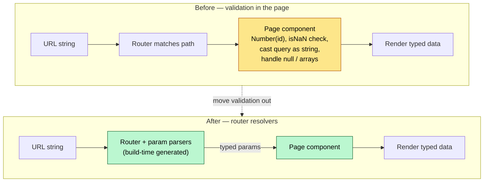

## The Core Argument

The URL is just another piece of state, but it's the only state the user can actually see, share, and bookmark. That makes it uniquely valuable — and uniquely painful, because a URL is always a string. Every page ends up with the same parsing boilerplate: `Number(id)`, `isNaN` checks, casting `query.q` as a string, filtering out arrays and nulls. Eduardo's proposal: that's the router's job, not the page's.

Vue Router 5 ships an experimental `router resolvers` API with param parsers. You declare the type in the filename (`[productId=int].vue`), plug in a `defineParamParser`, and the page receives typed params. The validation code disappears.

## The Three Superpowers of URL State

Eduardo frames _why_ URL state matters differently from refs, Pinia stores, or `localStorage`:

- **Teleportation** — you copy-paste a link and the recipient lands in the same state. No other state mechanism gives you this.
- **Time travel** — the browser's back/forward buttons are free `useRefHistory`.
- **Server↔client communication** — redirects from an unauthenticated dashboard to `/login?next=/dashboard` and back. Limited but real.

These only work because the URL is visible. That visibility is also why breaking URL schemas is expensive in a way breaking a component prop isn't — users have bookmarks.

## Strict vs Resilient Parsing

The API splits validation by where the param lives:

- **Path params are strict.** A bad parse throws; the resolver skips that route and tries the next match. This makes routing predictable — a product page with an invalid ID never renders with garbage data; it falls through to a 404.
- **Query params are resilient.** They fall back to `undefined` or a configured default. That matches how query strings are actually used: optional filters, pagination, sort order.

This split is quiet but important. Path = identity, query = configuration. Treating them with the same validation rules conflates two different jobs.

## Where Validation Lives

## Custom Parsers Are the Escape Hatch

The built-in `int` and `bool` parsers are deliberately minimal. The real expressiveness is in `defineParamParser`:

- `get(value: string)` — transform the raw string into whatever you want (a `Date`, a domain object, anything). Throw to miss the match.
- `set(value)` — inverse, used when navigating programmatically. Can return an empty string to signal "let `get` re-validate on read."

Validation lives in one place (the getter), because the router runs the setter-then-getter pipeline to normalise. No duplicated logic across script and template.

## The AI Angle

Eduardo made this explicit: "this has less tokens, less words for humans — it's a more efficient way to work." Half a component being string-parsing boilerplate isn't just noise for humans reading the code, it's noise in the context window when an LLM edits the file. He demoed refactoring a page with Codex against the new API — the diff was mostly deletions.

This is the deeper reason to care about the pattern: every line of validation boilerplate is a line the AI has to re-read, re-match, and not break on every edit. Pushing it into a deterministic plugin and out of the page is a tax cut on future edits.

## What Ships and When

- Available **today** in Vue Router 5 under `vue-router/experimental`. Non-breaking — you upgrade to v5 safely, then opt in to the experimental parsers.
- `unplugin-vue-router` has been merged into Vue Router core. File-based routing is now first-party.
- The resolver is **static** — parsing moves to build time, which is how they hit a **30% bundle-size reduction** on the minified router (~6 KB). Dynamic routing isn't yet supported in this mode.
- Still to land: automatic canonical URL generation, nested alias fixes, a real target Vue 6 release.

Eduardo's prep advice: get off raw route strings, adopt type routes + file-based routing now so the parser upgrade is a rename, not a rewrite. Build your Zod/Valibot validators assuming they'll eventually plug in here.

## Alexander's Take

This is Ousterhout's "deep module" pattern applied to routing — see [[deep-and-shallow-modules]]. The router's surface stays tiny (`route.params.productId`), but it absorbs the complexity of parsing, validation, and type inference. Pages stop being half-setup, half-app. Every Vue app I've shipped has this parsing boilerplate in at least three pages, and AI edits consistently fumble it because the intent (a typed `number`) is buried in three lines of defensive code.

The "less tokens" framing is the first time I've heard a framework author pitch an API in terms of LLM ergonomics directly. Expect more of this.

## Connections

- [[pinia-colada]] — Same author, same thesis: declarative, typed primitives that eliminate the "ref-for-data, ref-for-error, ref-for-loading" boilerplate. Pinia Colada did it for async state; router resolvers do it for URL state.
- [[deep-and-shallow-modules]] — Router resolvers are a textbook deep-module move: tiny interface (`route.params`), large hidden complexity (parsing, validation, type generation). Pages get thinner because the router gets deeper.
- [[vue3-development-guide]] — Belongs alongside the composables and architecture entries; the "where does validation live" question is a Vue 3 architecture decision now.
