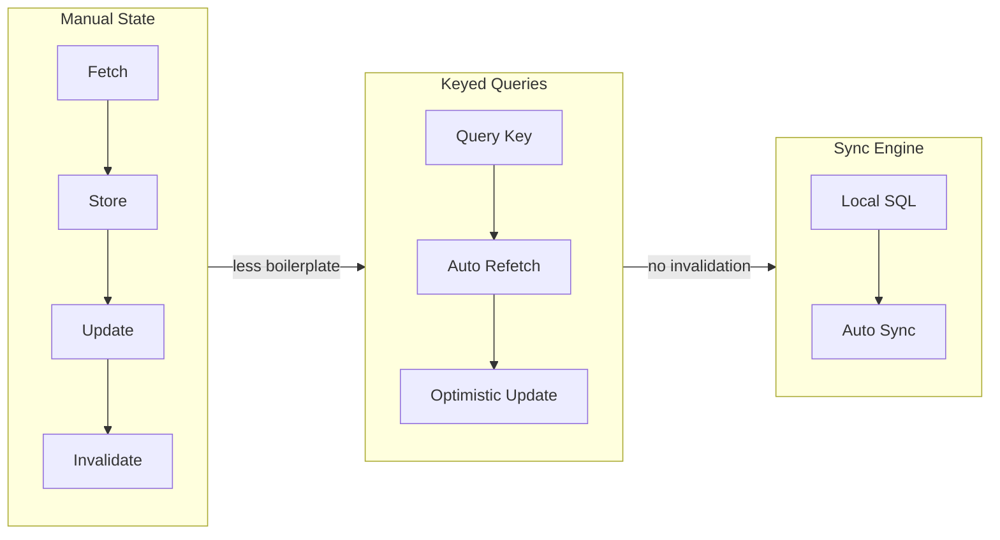

## Summary

Dev Agrawal demonstrates how sync engines transform application development by removing the network from the user interaction path. Instead of fetching data from servers, querying caches, and managing invalidation, developers write SQL against a local database. The sync engine handles bidirectional replication in the background. The article builds a collaborative agentic chat app to show how this architecture simplifies both real-time collaboration and AI agent integration.

## The Evolution of Data Fetching

The article traces three generations of client-server data management:

- **Manual state management** — developers fetch, store, and update data through procedural logic. Every interaction requires explicit network calls, cache updates, and error handling.
- **Keyed queries** (TanStack Query era) — data retrieval uses invalidatable query keys with automatic refetches. Optimistic updates remain complex, requiring manual rollback logic.
- **Sync engines** — mutations go to a local database. Affected queries rerun automatically. No invalidation logic, no loading states, no manual cache management.

## Visual Model



::

## Agentic Integration Patterns

The most novel contribution is showing three ways to integrate AI agents with sync-powered apps:

1. **Traditional** — streaming infrastructure, manual state management, client orchestrates everything
2. **Database-persisted** — agents write responses to the database, sync engine distributes to clients
3. **Event-driven** — server watches database changes, agents respond directly to new rows, no client request cycle needed

The event-driven pattern makes agents durable: they persist work to the database, survive crashes, and process messages queued while offline.

## Key Code Pattern

The server-side agent watches for new messages with a reactive query:

```javascript
for await (const userMessages of db.watch("SELECT * FROM messages WHERE author_type = 'user'")) {
  // detect mentions, generate response, insert into database
  // sync engine handles delivery to all connected clients
}
```

## Current Limitations

The article honestly acknowledges sync engines still face challenges: difficult backend integration, maturity concerns, database lock-in risks, limited client runtime support, and lacking enterprise compliance features.

## Connections

- [[ux-and-dx-with-sync-engines]] — Carl Assmann makes the same core argument about removing network latency from the interaction path, focusing on the UX and DX improvements
- [[native-grade-web-apps-with-local-first-data]] — Johannes Schickling's talk covers the same sync engine architecture with client-side SQLite, framing it as the declarative revolution for data management
- [[what-is-local-first-web-development]] — provides the foundational principles (the seven ideals) that sync engines like PowerSync implement in practice
