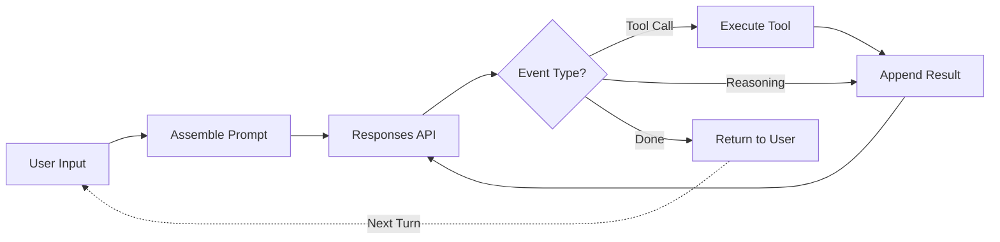

## Summary

Michael Bolin dissects the internals of OpenAI's Codex CLI to reveal how the agent loop actually works. The architecture is simpler than expected: an LLM receives a prompt, decides whether to call tools, executes those calls, and loops until finished. The engineering challenge isn't the loop itself—it's managing performance as conversations grow.

## The Agent Loop Structure

Every agent follows the same fundamental pattern:

**Outer loop** — User sends a prompt, system processes until the model returns a final response, then waits for new input.

**Inner loop** — Model generates output events. Tool call events trigger execution and result collection. Reasoning events get appended to context. Loop continues until a "done" event signals completion.

::

## Prompt Assembly

The initial prompt combines three components:

- **Instructions** — System message with coding standards and behavior guidelines
- **Tools** — List of MCP servers the agent can invoke
- **Input** — Text, images, files including AGENTS.md, environment info, and the user's message

## The Stateless Insight

Codex uses a fully stateless interaction model. Rather than relying on server-side conversation memory, it resends the entire conversation history with every request. This design choice enables model-agnostic operation—any model wrapped by the Responses API works, including locally-hosted open models.

## The Quadratic Problem

LLM inference performance is quadratic in terms of JSON sent to the Responses API over a conversation's lifetime. Without optimization, each turn processes more tokens than the last.

Two mechanisms address this:

**Prompt caching** — Reuses output from previous inference calls, making performance linear instead of quadratic. Cache misses occur when changing tools, switching models, modifying sandbox permissions, or reordering tool definitions.

**Context compaction** — When conversation length exceeds a token threshold, the agent calls a `/responses/compact` endpoint that provides a smaller representation using opaque encrypted content. Reasoning items from earlier turns get removed since models don't reuse previous reasoning.

## Key Architectural Decisions

- **Rust rewrite** — Codex CLI moved from JavaScript to Rust for improved memory and CPU usage
- **Model-specific training** — Codex models are trained specifically for their tools, with formats like `apply_patch` built directly into the model
- **Visible vs. internal reasoning** — The reasoning tokens shown to users represent only a fraction of internal processing

## Connections

- [[building-effective-agents]] — Anthropic's guide shares the "simplicity first" philosophy, emphasizing that sophisticated behavior emerges from basic components
- [[12-factor-agents]] — Factor 12 advocates for stateless reducer design, the same pattern Codex implements
- [[how-to-build-an-agent]] — Thorsten Ball's minimal Go implementation demonstrates the same tool-call loop at the foundation
- [[context-efficient-backpressure]] — Practical techniques for managing the context growth problem Bolin describes
