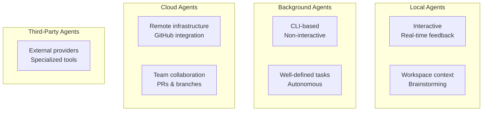

## Key Concepts

Agents differ from standard AI chat by handling **complete coding tasks end-to-end**. They understand project context, modify multiple files, execute commands, and adapt based on results.

The key distinction: agents don't just suggest code—they autonomously perform work while you maintain oversight.

## The Four Agent Types

VS Code supports four execution modes, each suited to different workflows:

::

### Local Agents

Run within VS Code with real-time feedback. Best for:

- Brainstorming and planning
- Tasks requiring immediate workspace context
- Interactive refinement of solutions

### Background Agents

CLI-based tools (like Copilot CLI) operating non-interactively. Best for:

- Well-defined autonomous tasks
- Batch operations
- Tasks that can run unattended

Background agents can use Git worktrees for isolated work environments.

### Cloud Agents

Run on remote infrastructure with GitHub integration. Best for:

- Team collaboration via pull requests and branches
- Long-running tasks that shouldn't tie up your machine
- CI/CD integration workflows

### Third-Party Agents

External provider agents integrated into VS Code's unified experience. Best for:

- Specialized domain tools
- Vendor-specific integrations

## Session Management

All agent types share unified session management:

- **Unified Chat View**: Central management regardless of execution location
- **Session Handoff**: Delegate between agent types using "Continue In" controls or `@cli`/`@cloud` mentions
- **File Change Review**: View diffs before applying modifications
- **Session Organization**: Rename, archive, filter by status

Sessions are workspace-scoped with automatic time-based grouping.

## Enabling Agents

Requires the `chat.agent.enabled` setting to be enabled.

## Connections

- [[introducing-agent-skills-in-vs-code]] - Skills define the specialized knowledge agents use; this documents where those skills execute
- [[context-engineering-guide-vscode]] - Same author's guide to feeding agents the right project context for better results
