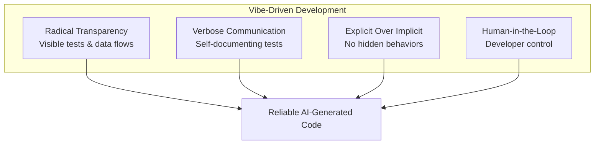

## Summary

VDD bridges the gap between informal AI-assisted coding and software engineering discipline. Rather than introducing novel concepts, it systematizes practices developers already use intuitively when working with AI tools. The methodology addresses two failure modes: treating AI as a mere syntax generator, or relinquishing control entirely.

## The Four Pillars

VDD rests on four core principles:

1. **Radical Transparency** — Make tests, data flows, and transformations visible. Hidden behavior creates debugging nightmares when AI generates unexpected code paths.

2. **Verbose Communication** — Tests explain functionality clearly. The test suite becomes documentation for both humans and AI agents.

3. **Explicit Over Implicit** — Avoid hidden behaviors or assumptions. Every behavior should be traceable to a visible source.

4. **Human-in-the-Loop** — Maintain developer control while leveraging AI capabilities. AI accelerates; humans steer.

## Diagram

::

## Essential Patterns

The methodology introduces specific patterns for implementation:

- **DevDocs** — Structured documentation that AI agents can consume
- **Anchor** — Fixed reference points in code that guide AI decisions
- **Smoke Tests** — Quick validation checks after every AI-generated change
- **Fuzzy Architecture** — Flexible system design that accommodates AI-generated variations

## Target Audience

VDD addresses developers frustrated with:

- AI-generated code that looks right but breaks in production
- Codebases that remain unclear despite having tests
- Simple changes that cause unexpected cascading failures

## Connections

- [[vibe-coding-for-production-quality]] — Reddit discussion on vibe coding guardrails; VDD provides the theoretical framework for the practical advice given there
- [[spec-driven-development-with-ai]] — Spec Kit offers a complementary approach, separating specification from implementation; VDD focuses more on testing and transparency
- [[no-vibes-allowed-solving-hard-problems-in-complex-codebases]] — Dex Horthy's Research-Plan-Implement workflow shares VDD's emphasis on structure over pure vibes
