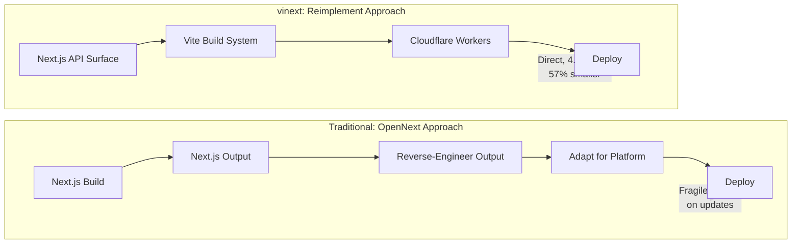

Cloudflare didn't wrap Next.js output for their platform. They reimplemented the entire API surface on Vite. One engineer. One week. $1,100 in API tokens. That's either the most impressive AI-assisted engineering demo yet or the biggest cognitive debt bomb waiting to detonate.

## The Problem with Wrapping

Deploying Next.js outside Vercel has always been painful. Tools like OpenNext reverse-engineer Next.js's build output and adapt it for other platforms — a fragile approach that breaks whenever Vercel changes internals. Faulkner calls this out directly: building on top of Next.js output is a difficult and fragile foundation.

vinext takes the opposite approach: reimplement the Next.js API surface directly on Vite. Same developer-facing APIs (file-system routing, RSC, server actions, ISR, middleware), completely different build pipeline underneath.

::

## The Numbers

The performance gap is stark:

| Metric      | Next.js 16.1.6 | vinext (Vite 8/Rolldown) | Improvement |
| ----------- | -------------- | ------------------------ | ----------- |
| Build time  | 7.38s          | 1.67s                    | 4.4x faster |
| Bundle size | 168.9 KB       | 72.9 KB                  | 57% smaller |

These aren't micro-benchmarks. The bundle size difference alone means real-world loading improvements for every user. Rolldown (Vite 8's Rust-based bundler) is doing the heavy lifting on the build side.

## Traffic-Aware Pre-Rendering

The most original idea: instead of pre-rendering all 100,000 product pages at build time, analyze Cloudflare analytics to identify which pages actually get traffic and only pre-render those. If 200 pages cover 90% of traffic, why waste build time on the other 99,800? This is the kind of insight you get when the platform also runs the CDN.

## The AI Development Story

A single engineer directed AI through 800+ OpenCode sessions. The workflow: define task, AI generates code and tests, verify against test suite, iterate on failures. The result: 1,700+ unit tests, 380 E2E tests, 94% API surface coverage.

Faulkner's framing of why this worked is worth sitting with:

- Well-documented APIs (Next.js has extensive Stack Overflow coverage)
- Comprehensive existing test suites to port
- Solid foundation (Vite's plugin architecture)
- Models capable of maintaining coherence across a codebase

The conditions aren't universally replicable. Not every project has a well-documented API to reimplement against, or an existing test suite to validate against. This worked because the problem was well-constrained.

## The Deeper Claim

The most provocative argument buried in the post: many software abstractions exist because of human cognitive limitations, not technical necessity. If AI can hold entire systems in context, intermediate frameworks become unnecessary overhead. Faulkner suggests that the layers we've built over the years aren't all going to survive.

This is either visionary or dangerously naive depending on your perspective on [[cognitive-debt]]. The code passes quality gates — but does the team _understand_ 1,700 tests they didn't write? Can they extend the system when the model's context window isn't enough?

## Connections

- [[cognitive-debt]] — vinext is the perfect stress test for Storey's thesis: AI-generated code that passes all quality gates but was authored by a single engineer directing AI through 800+ sessions — does shared understanding exist?
- [[the-creator-of-claudbot-i-ship-code-i-dont-read]] — Peter Steinberger's "close the loop" principle in action at infrastructure scale: AI writes code, comprehensive test suite verifies, human reviews architecture rather than individual lines
- [[how-ai-will-change-software-engineering]] — Fowler called AI the biggest shift since assembly-to-high-level-languages; vinext is an early proof point — one engineer rebuilding a framework in a week
