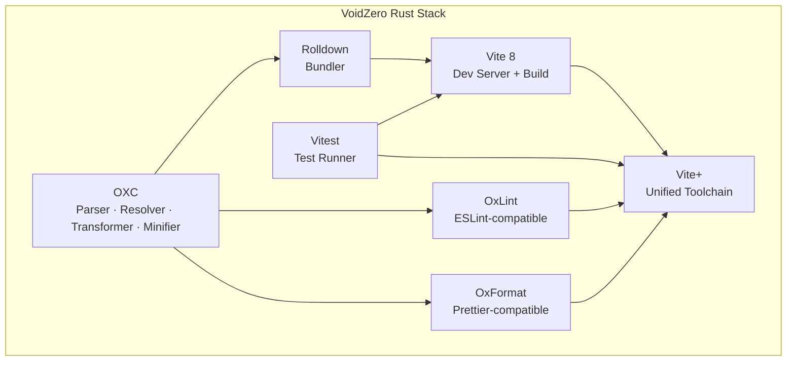

## Timestamps

| Time  | Topic                                             |
| ----- | ------------------------------------------------- |
| 00:00 | Evan You's intro and VoidZero overview            |
| 02:00 | How Vite's dual-bundler architecture emerged      |
| 08:00 | Why Rolldown exists: replacing ESBuild + Rollup   |
| 12:00 | OXC: the Rust toolchain foundation                |
| 16:00 | The vertical stack vision                         |
| 19:00 | Why bundlers still matter vs. import maps         |
| 25:00 | Vite+ and the fresh-start developer experience    |
| 30:00 | VoidZero's business model and licensing           |
| 33:00 | AI agents and code quality in fast-shipping teams |
| 38:00 | Rust vs. Go for tooling                           |
| 42:00 | React Server Components critique                  |
| 48:00 | Vercel's acquisition of Nuxt Labs                 |

## Key Arguments

### The Dual-Bundler Problem (02:00)

Vite uses ESBuild for dev pre-bundling and Rollup for production builds. ESBuild handles speed but lacks chunk-splitting control and extensible plugins. Rollup provides flexibility but runs in single-threaded JavaScript. The mismatch creates subtle behavior inconsistencies between dev and production—different tree-shaking, different ESM/CJS graph handling—that the team has to patch around constantly.

### Why Rolldown Needed to Exist (08:00)

Making Rollup faster proved impossible: mixing a Rust parser (SWC) into a JavaScript bundler yielded no net gain because the data-passing cost between Rust and JS offset the raw performance improvement. The only path forward was a full Rust rewrite. Rolldown ports Rollup's API shape but with ESBuild's built-in scope—resolver, transforms, minifier—all in one pass instead of repeated parse-transform-codegen cycles per plugin.

### OXC as the Foundation Layer (12:00)

OXC's parser is roughly 3x faster than SWC's Rust parser thanks to an arena allocator that places the entire AST in consecutive memory. This design also enables fast JS plugin interop by passing the memory chunk to JavaScript without cloning. Boshen (OXC's author, now VP Engineering at VoidZero) optimized for composability—each tool (parser, resolver, transformer, minifier, linter, formatter) ships as a standalone Rust crate.

### Bundlers Still Win Past a Threshold (19:00)

Unbundled ESM works below roughly 1,000 modules. Beyond that, the browser must send an HTTP request per module and traverse the import graph serially—deep graphs multiply network round-trips. At 3,000+ modules, even local Vite dev takes 1–2 seconds to load. Production over a real network would be far worse. Bundling compresses that to ~100ms. The anti-bundler sentiment comes from Webpack-era configuration trauma, not from a technical argument against bundling itself.

### Vite+ as the Zero-Config Starting Point (25:00)

Vite+ targets a complete beginner who has never installed Node. A single `curl` installs a global `vp` binary that manages Node versions, package managers (recommending pnpm), linting (OxLint), formatting (OxFormat), and testing (Vitest). It ships agent-ready `.md` skills that auto-update on upgrade—so AI coding agents always use current APIs rather than hallucinating deprecated options.

## Visual Model

::

## Predictions Made

- **Vite+ will feel like Bun for onboarding** — A single binary replaces nvm, corepack, and the NI package. (Confidence: high)
- **AI agents will need tooling-author guardrails** — Without updated skills files, agents hallucinate deprecated options and silently disable safety checks. (Confidence: high)
- **RSC won't become a universal pattern** — Too many DX trade-offs and server-cost implications for it to escape the Next.js-specific niche. (Confidence: medium)

## Notable Quotes

> "We are swapping the engines of a flying plane and hope it will just operate smoothly afterwards."
> — Evan You on migrating Vite 8 from Rollup/ESBuild to Rolldown

> "AI will take shortcuts if you don't give it guardrails."
> — Evan You on agents disabling type-checking rules and hallucinating config options in the OpenClaw codebase

> "We're shipping much faster now. We're also accumulating tech debt much faster."
> — Evan You on AI-accelerated development needing AI-powered code health monitoring

## Connections

- [[antfu-skills]] - Anthony Fu works at VoidZero and his skills repo is designed for the exact Vite/Vitest ecosystem Evan You describes building agent-ready tooling for
- [[vitest-browser-mode-viteconf-2023]] - Vitest is part of VoidZero's unified stack; this talk covers Vitest's browser testing capabilities built on the same Vite foundation
- [[essential-ai-coding-feedback-loops-for-typescript-projects]] - Matt Pocock's feedback loop patterns address the same problem Evan You raises: AI agents shipping fast without guardrails need automated type-checking and test verification
