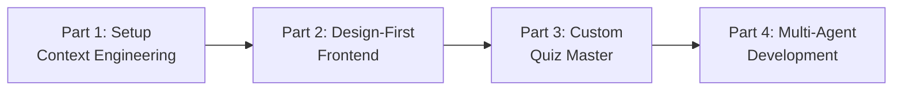

## Summary

An interactive workshop for building a Social Bingo game while mastering GitHub Copilot's Agent Mode. The focus is on AI-first development practices: teaching your AI coding assistant about your codebase through structured instructions rather than fighting against generic suggestions.

## Four Core Competencies

The workshop covers four skill areas essential for working effectively with AI coding agents:

1. **Context Engineering** — Providing project-specific guidance to improve suggestion quality. The more the AI knows about your patterns, the better its output.

2. **Agentic Primitives** — Using background agents, cloud agents, and custom workflows. These allow autonomous task execution while you maintain oversight.

3. **Design-First Development** — Iterating on UI components with specialized design agents before writing implementation code.

4. **Test-Driven Development** — Implementing features with Red-Green-Refactor patterns. AI excels at generating test cases once it understands the expected behavior.

## Workshop Flow

::

## Prerequisites

- VS Code v1.107+
- GitHub Copilot subscription
- .NET 10 SDK
- Git

## Key Insight

The workshop emphasizes that effective AI-assisted development isn't about better prompts in the moment — it's about setting up persistent context that guides the AI across all interactions. This aligns with the broader shift from "prompt engineering" to "context engineering."

## Connections

- [[vscode-copilot-workshop]] - Covers the same core concepts (context engineering, AGENTS.md, subagents, skills) but for a general audience rather than .NET-specific
- [[context-engineering-guide-vscode]] - Microsoft's official guide to the custom instructions and planning agents workflow demonstrated in this workshop
- [[moc-vscode-ai-coding]] - Entry point for the broader VS Code AI coding ecosystem
