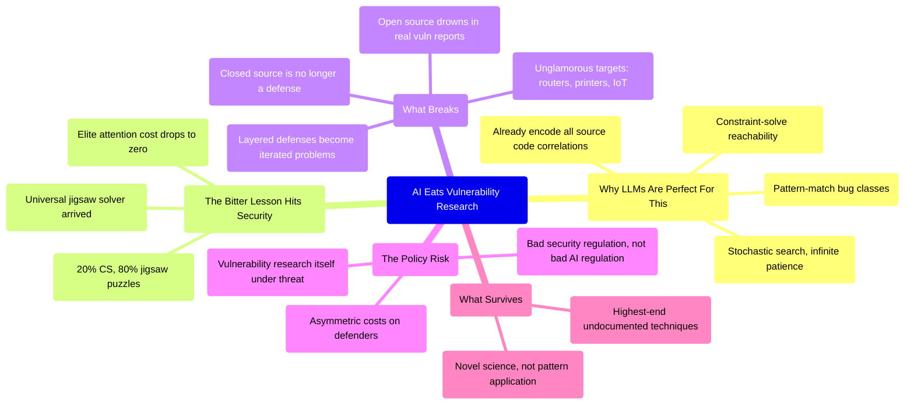

## The Argument

Thomas Ptacek spent 15 years in vulnerability research and watched the field evolve from garage-band stack smashing in the 1990s to hyper-specialized font-library spelunking in the 2010s. His core claim: that entire arc of increasing specialization is about to get flattened by LLM agents.

The reasoning is tight. Vulnerability research is 20% computer science and 80% jigsaw puzzle — pattern-matching known bug classes against specific codebases, then constraint-solving for reachability and exploitability. That's exactly the search problem LLMs are built for. Agents never sleep, never get bored, and the stochastic nature of inference means each run takes a different path through the code.

## Carlini's Embarrassingly Simple Pipeline

The most striking detail: Nicholas Carlini at Anthropic's Frontier Red Team doesn't use sophisticated tooling. He runs a bash loop over every source file in a repo with the same prompt — "find me an exploitable vulnerability starting from this file." Then he feeds each report back through Claude to verify exploitability. Success rate: near 100%. He pointed this at Ghost CMS and got a broadly exploitable SQL injection.

No code indexers, no model checkers, no fuzzers. Just the model, raw. The Bitter Lesson — that scale and compute always beat human-crafted heuristics — is fractally true, and it just arrived in security.

## The Attention Scarcity Shield Is Gone

Ptacek's best insight: we've been protected not just by engineering countermeasures but by a scarcity of elite attention. Routers, printers, hospital systems, IoT dishwashers — these targets were safe because elite researchers chased high-status browser exploits instead. When elite attention costs epsilon, everything gets targeted. The risk models baked into every IT shop in North America no longer hold.

Open source maintainers already drowning in slop vulnerability reports should brace for the real thing — steady feeds of verified, reproducible, high-severity bugs that actually need fixing.

## The Real Threat: Bad Regulation

Ptacek's most contrarian move is where he puts the danger. Not the exploits themselves — Chrome, iOS, Android are well-funded and auto-update. The danger is that politicians will craft incoherent security regulation in response to ransomware headlines, imposing asymmetric costs on defenders while unregulated open-weight models give attackers the same capabilities 9 months later anyway.

The security industry has agreed for decades that vulnerability research is computer science — disclosure reveals important information about the world. But when teenagers can generate full-chain browser exploits, do we even agree about what the field should stand for?

## What Survives

Ptacek's honest concession: there's still room for human researchers at the very highest end — undocumented techniques, novel science that isn't in the training data. But most exploit development isn't new science. It's determination, luck, debugging skill, and conversance with the literature. That's exactly what agents replicate.

## Connections

- [[an-ai-state-of-the-union-weve-passed-the-inflection-point-and-dark-factories-are-coming]] - Simon Willison warned about "the Challenger disaster of AI security" on the same podcast; Ptacek is describing the specific mechanism by which that disaster arrives
- [[90-of-my-skills-are-now-worth-0]] - Kent Beck's 90/10 split applied to security: the jigsaw-puzzle 80% of vulnerability research just got automated, leaving only the novel-science 10% with human value
