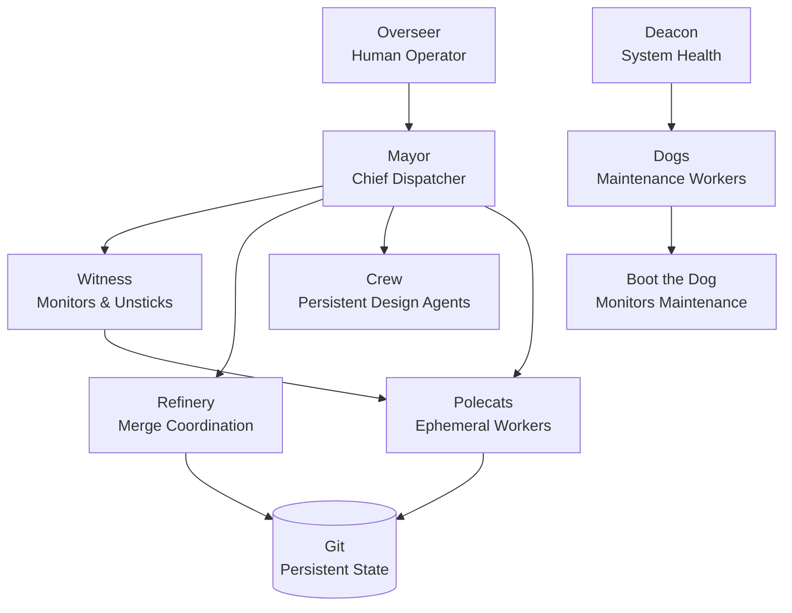

## Summary

Steve Yegge introduces Gas Town, his multi-agent orchestration framework built in Go atop his [[beads]] issue tracker. Gas Town manages colonies of 20-30 parallel Claude Code agents through a hierarchy of specialized roles, persistent workflow state, and Git-backed crash recovery. The system targets developers at "Stage 7-8" of AI-assisted coding—those already running multiple agents manually who need industrial-scale coordination infrastructure.

## Key Arguments

**Agent orchestration demands specialization.** Gas Town assigns permanent roles to agents using Mad Max-inspired naming: Mayor (planning and dispatch), Polecats (ephemeral implementation workers), Witness (monitoring and unsticking blocked agents), Refinery (merge coordination), Deacon (system health daemon), and Crew (persistent long-lived agents for design work).

**Persistent identity, ephemeral sessions.** Agent identities and task assignments survive in Git; individual coding sessions are disposable. The GUPP principle (Gas Town Universal Propulsion Principle) ensures agents execute work on their hooks, so workflows persist across crashes and restarts via `gt sling` and `gt handoff` commands.

**The MEOW Stack structures all work.** Gas Town's workflow persistence layer—Molecules, Epics, and Organized Work—breaks down into Beads (atomic tasks in JSONL), Epics (hierarchical collections), Molecules (instantiated workflow graphs with dependencies), Protomolecules (reusable templates), and Formulas (TOML-based workflow definitions).

**Three development loops govern the pace.** The outer loop (days-weeks) handles strategic planning. The middle loop (hours-days) manages agent spawning and coordination. The inner loop (minutes) drives frequent handoffs, task specs, and output review.

**Vibe coding at industrial scale.** Yegge claims he never reviews the generated code—Gas Town itself is "100% vibecoded." The system prioritizes throughput over perfection: most work gets done, some work gets lost, and creation happens at the speed of thought.

## Agent Hierarchy

::

## Notable Quote

> "It is 100% vibecoded. I've never seen the code, and I never care to." — Steve Yegge

## Connections

- [[gas-towns-agent-patterns]] — Maggie Appleton's analysis of the same system, focusing on design bottlenecks and emerging orchestration patterns when agents handle implementation at scale
- [[beads]] — Yegge's git-backed issue tracker that serves as Gas Town's task management layer; Beads provides the atomic work units (hash-based IDs, dependency tracking) that Gas Town's workflows orchestrate
- [[anthropic-just-dropped-agent-swarms]] — Claude Code's native agent teams implement a simpler version of the same pattern: shared task lists with dependency blocking and inter-agent messaging
