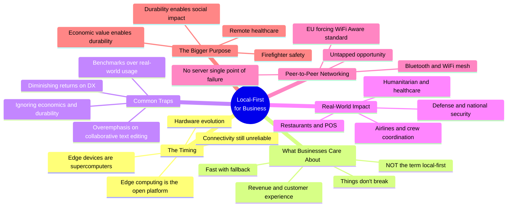

## Overview

Adam Fish has been building sync engines for 13 years — from a failed CRM startup, through Realm (acquired by MongoDB), to founding Ditto in 2018. Ditto's differentiator: true peer-to-peer sync over Bluetooth and WiFi, no internet required. But this talk isn't about the tech. It's about a harder problem: making businesses care.

::

## Key Arguments

### The Status Quo Is the Real Competition

After 13 years, Fish's most controversial takeaway: traditional request-response architectures are fine for most businesses. That's the competition — not another sync engine, but the default of "keep doing what we've always done." Great technology alone won't overcome that inertia.

### Edge Computing Is the Open Platform

The timing argument is compelling. The iPhone 10 in 2018 was a supercomputer compared to the original iPhone — serious CPU, GPU, battery. Silicon carbon batteries launching now add 30-50% more energy density. All this compute power sits largely untapped. Cloud computing defined the last decades; edge computing defines the next ones. Local-first lives at the edge.

### Businesses Don't Care About "Local-First"

They care about their business: making money, delivering great customer experiences, avoiding downtime. Fish's challenge to the community: stop speaking in technology terms and start speaking in business outcomes. Decentralized architectures mean systems don't break. Local data means faster fallbacks. High-quality software means more revenue.

### The Traps That Kill Local-First Products

Four traps Fish has watched people fall into:

1. **Collaborative text editing** — the ultimate CRDT showcase, but most businesses aren't collaboratively editing documents
2. **Benchmark obsession** — how people use software in the real world diverges wildly from benchmarks (Realm learned this the hard way)
3. **Developer experience past the point of diminishing returns** — matters, but doesn't translate linearly into business value
4. **Ignoring economics** — if the software isn't sustainable, it won't last. Ditto's customers are deploying into systems expected to run for decades

### The Networking Gap Nobody Talks About

While mobile hardware leapt forward over 10 years, wireless connectivity barely improved. 5G helps, but wireless is fundamentally unreliable. The "last mile" and even the "last few feet" of connectivity remain painful for businesses. Ditto's mesh networking — devices forming ad-hoc networks over Bluetooth LE and peer-to-peer WiFi — turns "offline" into just another network topology.

The EU is about to make this easier by forcing Apple to adopt WiFi Aware, the open standard for peer-to-peer WiFi. Android and iOS devices will finally talk directly over WiFi without Apple's proprietary AirDrop stack.

### From Economic Value to Social Value

The talk's emotional core: economic sustainability enables durability, and durability enables social impact. Fish shares how Ditto powers wildfire firefighting — a Cal Fire presentation revealed a firefighter died because a tanker crew didn't know someone was on the ground. A simple lat/long coordinate could have saved his life. Remote healthcare, humanitarian nutrition screenings, defense operations — these use cases only work if the company behind the technology survives long enough to serve them.

## Notable Quotes

> "After those 13 years, one thing I have learned is that unfortunately traditional architectures — they're fine."

> "Businesses don't really care about local-first. What they care about is they're running their business."

> "Ignoring the economics of what we do ultimately means we might not be building durable stuff."

## Practical Takeaways

- Frame local-first benefits in business language: reliability, speed, cost reduction — not CRDTs, peer-to-peer, eventual consistency
- The networking layer (mesh, peer-to-peer) is an underexplored differentiator beyond pure data sync
- Build sustainable businesses around the technology or the impact disappears when the company does
- Edge computing is the next platform shift — the hardware is ready, the software isn't

## Connections

- [[local-first-software-pragmatism-vs-idealism]] — Same conference, complementary angle. Wiggins frames the idealist/pragmatist partnership; Fish argues the pragmatist side harder — without business adoption, the ideals stay academic
- [[the-past-present-and-future-of-local-first]] — Kleppmann envisions commoditized sync infrastructure; Fish shows what happens when you try to sell that to restaurants and airlines instead of developers
- [[unexpected-benefits-of-going-local-first]] — Linear's story validates Fish's thesis from the other direction. Artman discovered business value (developer productivity, infrastructure savings) that Fish argues should be the pitch, not the afterthought
- [[why-local-first-apps-havent-become-popular]] — Bambini diagnoses the technical adoption gap; Fish diagnoses the business adoption gap. Both point to the same conclusion: the technology works, the packaging doesn't
