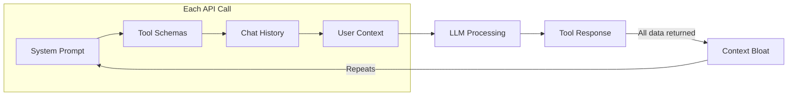

## Summary

Gospodarczyk argues that MCP (Model Context Protocol)—marketed as "USB for AI"—faces challenges stemming from LLM limitations rather than protocol design flaws. Tool schemas consume tokens before work begins, instruction-following degrades as context accumulates, and agentic workflows trigger hundreds of LLM calls with significant latency and cost.

## Key Problems

**Context Bloat**
Tool schemas accumulate rapidly. With dozens of tools defined, system prompts consume substantial tokens before actual work begins. Each API call repeats this overhead.

**Inference Costs**
Typical inference speed runs 32-55 tokens per second. Complex agentic workflows trigger hundreds of LLM calls, creating latency and expense (Gospodarczyk reports $3,000-$5,000 monthly bills).

**Tool Response Design**
Official MCPs often map APIs one-to-one, returning responses full of irrelevant data that confuse models. Developers must redesign responses for LLM consumption, not direct API usage.

**Instruction Following Degradation**
Performance and accuracy decline as conversations lengthen and context accumulates, affecting the model's ability to follow the original task.

## The Context Bloat Problem

::

## Solutions

**Context Management**

- Favor opinionated, optimized servers over official implementations
- Write concise tool descriptions enabling understanding without external documentation
- Consolidate related endpoints to reduce schema bloat

**Progressive Disclosure**
Load tool definitions only when needed rather than upfront. This dramatically reduces initial context size.

**Output Control**
Let models specify desired fields (minimal/standard/full) rather than receiving all data.

**Code Execution Mode**
Allow agents to write and execute sandboxed code, providing maximal flexibility with minimal upfront context.

## Core Takeaway

> "The Model Context Protocol itself has various flaws, but overall, it isn't that bad. In practice, it doesn't make too much of a difference."

The real bottleneck is LLM capability, not the protocol enabling tool access. Success requires understanding tokenization, context management, prompting strategies, and agentic workflow design—fundamentals beyond MCP's scope.

## Connections

- [[the-context-window-problem]] - Explores the same fundamental constraint: frontier models cap at 1-2M tokens while enterprise codebases span millions, requiring sophisticated context layering strategies
- [[12-factor-agents]] - Factor 3 ("Own Your Context Window") directly addresses the context bloat problem Gospodarczyk describes, arguing small focused agents outperform monolithic ones
- [[context-efficient-backpressure]] - Provides practical techniques for the same problem: suppress verbose output to preserve context for meaningful work
