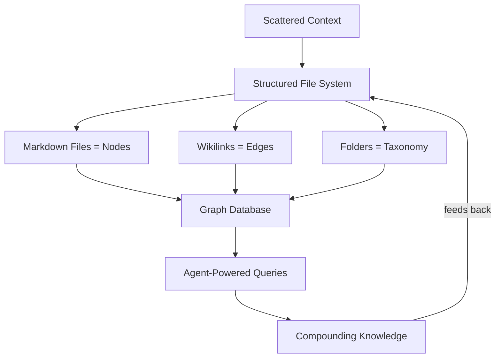

## Summary

Alex Kessinger runs a 52,000-file Obsidian vault and makes a disarmingly simple claim: you don't need a vector store, a graph database, or any retrieval infrastructure. Markdown files are nodes. Wikilinks are edges. Folders are taxonomy. You already have a graph database — you just need to start treating it like one.

The real argument isn't about file formats, though. It's about compounding. Six months of linked meeting notes, design docs, and people profiles turn a generic LLM prompt into something with actual institutional memory behind it.

## Key Points

- **The graph is already there.** Files are nodes, wikilinks are edges, folders provide taxonomy. No schema migrations, no query language — just markdown and links. The file system _is_ the database.

- **PARA as database schema.** Kessinger adapts Tiago Forte's PARA method as folder structure: `/projects/`, `/areas/`, `/people/`, `/daily/`, `/meetings/`. Each folder type creates a different semantic layer in the graph.

- **Agents as the ingestion layer.** Meeting notes get auto-generated and linked to people and projects immediately. Documents get downloaded as markdown. The system builds itself through daily use rather than bulk imports.

- **Context beats prompting.** The distinction from generic LLM use: anyone can ask an LLM to draft a design doc. But having six months of accumulated context — meeting notes, prior designs, Slack threads, architectural decisions — produces fundamentally different output. The knowledge base becomes an input layer.

- **Scale without infrastructure.** 52,447 files in a single Obsidian vault. No vector stores, no embeddings, no specialized retrieval. Plain files and links, queried by agents that can read and follow wikilinks.

- **One unsolved problem.** Automated inbox processing remains elusive — LLMs can summarize and categorize, but defining a consistent "processed" state that stays useful months later across diverse input types hasn't clicked yet.

## Connections

- [[file-over-app]] — Same philosophical foundation: plain text files outlast every app and database. Kessinger's vault is Steph Ango's philosophy taken to its operational extreme
- [[building-a-second-brain]] — Kessinger explicitly uses Tiago Forte's PARA system as his folder taxonomy, but extends it beyond personal productivity into an agent-queryable knowledge layer
- [[everything-is-context-agentic-file-system-abstraction-for-context-engineering]] — Both treat the file system as the natural abstraction for agent context, but Kessinger's approach is radically simpler — no framework, just folders and links
- [[agentic-knowledge-map]] — This article demonstrates the exact pattern the map tracks: using agent workflows to build and maintain persistent knowledge
