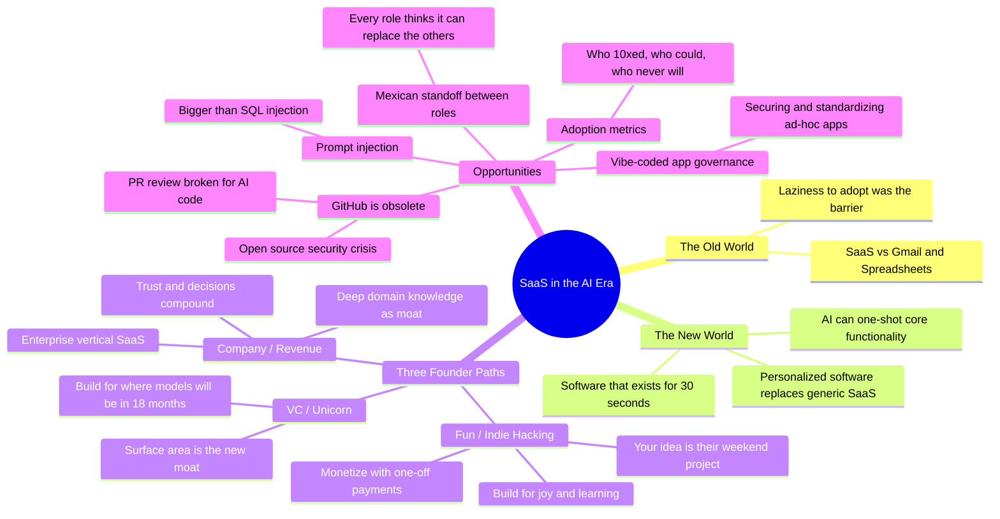

Andreas Klinger — former CTO of Product Hunt, now running PROTOTYPE fund — lays out the uncomfortable math for SaaS founders: the same tools that make building software trivially easy also make your product trivially replaceable. Your great SaaS idea? It's Christopher Janz's weekend project now.

::

## Key Takeaways

- **Code is no longer the moat.** The old world was SaaS vs. your Gmail-and-spreadsheet hack. Now it's SaaS vs. ChatGPT building the core functionality in 5 minutes. Toby Lütke of Shopify asked Claude to build him a medical scan viewer rather than install the doctor's Windows app. That's the competitive landscape now.

- **Three paths, three strategies.** Klinger breaks the founder decision into (1) build for fun as an indie hacker — ship fast, charge one-off, embrace the tinkerer community; (2) build a company that makes money — go enterprise vertical, stack domain knowledge and trust as your moat (he calls it "build Legora for your industry"); (3) chase the VC unicorn — which requires betting on where models will be in 18 months, not where they are today.

- **You're no longer paid for code, you're paid for trade-off decisions.** This was always true for senior devs, but now it's the entire job description. Knowledge work shifts from "I know things" to "I decide things, then AI builds."

- **Open source is in crisis.** Dozens of AI-generated PRs from people who haven't read your docs, an explosion of security vulnerabilities, and business models collapsing (hosting can be one-shotted, Tailwind-style module ecosystems can be replicated by autocomplete). If you can solve any part of this — monetization, review, security — that's a massive market.

- **The "Mexican standoff" between roles.** In every company, designers think they can replace engineers, engineers think they can replace designers, and PMs think they can replace everyone. This isn't limited to software — it's happening in film, music, every creative industry. Rethinking collaboration and role boundaries is a real opportunity.

- **Surface area is the new moat.** It doesn't matter which model runs behind Cloudbot. What matters is owning the interface, the user relationship, the surface area. This power dynamic is shifting fast.

## Notable Quotes

> "Your great idea for a little small SaaS app is their weekend project."

> "You're no longer getting paid for the code. You're getting paid for trade-off decisions."

> "Prompt injection will be bigger than SQL injections."

> "Don't build for the current times. Build for something like it's available in 18 months."

## Connections

- [[openclaw-the-viral-ai-agent-that-broke-the-internet]] — Klinger explicitly mentions Peter Steinberger and OpenClaw as the archetype of the indie hacker who vibe-codes everything into existence for the joy of it
- [[90-of-my-skills-are-now-worth-0]] — Kent Beck's thesis that AI devalues 90% of skills while giving 10% a 1000x boost maps directly onto Klinger's "you're paid for decisions, not code"
- [[ai-is-a-high-pass-filter-for-software]] — Bryan Finster argues AI amplifies existing capability rather than replacing it, which is exactly Klinger's point about domain knowledge being the real moat for enterprise SaaS
- [[ai-codes-better-than-me-now-what]] — Lee Robinson asks the same question Klinger answers: if AI writes the code, what's left for developers? Klinger's answer: trade-off decisions and domain expertise
